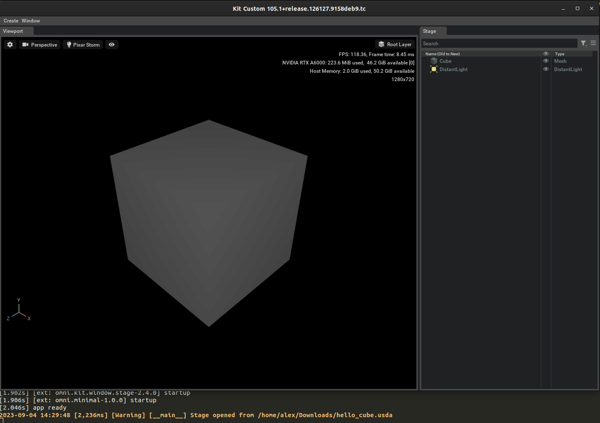

# Hello USD

Let's start right away and let us visualize a very simple cube mesh and a distant white light (to actually see the cube in the dark of the scene) in a very minimal setup for Omniverse Composer.

We assume that you have already installed Omniverse Composer on your local system.

## Hello USD(a)

This is the `usda` file that we'll be using

```python
#usda 1.0
(
    metersPerUnit = 0.01
    upAxis = "Y"
)

def Mesh "Cube"
{
    int[] faceVertexCounts = [4, 4, 4, 4, 4, 4]
    int[] faceVertexIndices = [0, 1, 3, 2, 4, 6, 7, 5, 6, 2, 3, 7, 4, 5, 1, 0, 4, 0, 2, 6, 5, 7, 3, 1]
    normal3f[] normals = [(0, 0, 1), (0, 0, 1), (0, 0, 1), (0, 0, 1), (0, 0, -1), (0, 0, -1), (0, 0, -1), (0, 0, -1), (0, 1, 0), (0, 1, 0), (0, 1, 0), (0, 1, 0), (0, -1, 0), (0, -1, 0), (0, -1, 0), (0, -1, 0), (-1, 0, 0), (-1, 0, 0), (-1, 0, 0), (-1, 0, 0), (1, 0, 0), (1, 0, 0), (1, 0, 0), (1, 0, 0)] (
        interpolation = "faceVarying"
    )
    point3f[] points = [(-50, -50, 50), (50, -50, 50), (-50, 50, 50), (50, 50, 50), (-50, -50, -50), (50, -50, -50), (-50, 50, -50), (50, 50, -50)]
    texCoord2f[] primvars:st = [(0, 0), (1, 0), (1, 1), (0, 1), (1, 0), (1, 1), (0, 1), (0, 0), (0, 1), (0, 0), (1, 0), (1, 1), (0, 0), (1, 0), (1, 1), (0, 1), (0, 0), (1, 0), (1, 1), (0, 1), (1, 0), (1, 1), (0, 1), (0, 0)] (
        interpolation = "faceVarying"
    )
    uniform token subdivisionScheme = "none"
    double3 xformOp:rotateXYZ = (0, 0, 0)
    double3 xformOp:scale = (1, 1, 1)
    double3 xformOp:translate = (0, 50, 0)
    uniform token[] xformOpOrder = ["xformOp:translate", "xformOp:rotateXYZ", "xformOp:scale"]
}

def DistantLight "DistantLight" (
    apiSchemas = ["ShapingAPI"]
)
{
    float inputs:angle = 1
    float inputs:intensity = 3000
    float inputs:shaping:cone:angle = 180
    float inputs:shaping:cone:softness
    float inputs:shaping:focus
    color3f inputs:shaping:focusTint
    asset inputs:shaping:ies:file
    double3 xformOp:rotateXYZ = (315, 0, 0)
    double3 xformOp:scale = (1, 1, 1)
    double3 xformOp:translate = (0, 0, 0)
    uniform token[] xformOpOrder = ["xformOp:translate", "xformOp:rotateXYZ", "xformOp:scale"]
}
```

some elements might already be familiar to computer graphics programmers: normals, point coordinates, UV coords, etc.

The following extensions and formats are possible in USD:

| Extension            | Format of the data inside the file                                      |
| --------------- | ------------------------------------------------ |
| .usda (or .usd) | ASCII human readable file. It can get quite large with complex 'flattened' scenes (i.e. scenes containing everything they reference outside collected into one single file). This can be written in a text editor. |
| .usdc (or .usd) | 'c' stands for 'crate', denotes compressed binary files. Designed for minimal parsing on file load (structure is set up at the top). Uses LZ4 in some parts. |
| .usdz | Uncompressed zip archive that can contain other usda/usdc/usd or image or audio files inside. Meant for publishing only and should not be used for editing but as a read-only format. Again: it's uncompressed, the zip aspect is just for bundling purposes. |

USDA files always start with `#usda 1.0` at the beginning while `usdc` have a magic number.

Remember that there are various tools that you can use to inspect USD files and operate on them, e.g. [usdview, usdcat, usddiff and a complete toolset from OpenUSD](https://openusd.org/release/toolset.html). We'll be using Omniverse tools instead.

If we save this `usda` text file on disk and open it with OV Composer, it will display a simple lit cube mesh.

## A usdview clone with OV Composer

As we previously said Omniverse allows you to develop your own extensions and write small and self-contained Kit applications for your own graphical needs.

Let's figure out on our local system where OV composer was installed (if we installed it via the official NVIDIA launcher of course). In our OV Composer install folder there are two important directories: `apps` and `kit`. The `kit` folder contains the Kit executable while the `apps` folder contains some `.kit` files that will be fed to the `kit` executable as command line parameters, for example:

```shell
~/.local/share/ov/pkg/create-2023.2.0$ ./kit/kit ./apps/omni.create.kit
```

The multiple `omni.app.full.sh` or `omni.app.full.bat` files are usually just to set up directories and launch the right `kit` files. The [NVIDIA documentation has great resources on kit files here](https://docs.omniverse.nvidia.com/kit/docs/kit-manual/latest/guide/creating_kit_apps.html).

To launch a full OV Composer app, a `omni.create.kit` file is usually used, more or less of the form (remember that `create` is the former name of `composer`):

```toml
[package]
title = "USD Composer"
description = "An Authoring application for USD and Omniverse Content"
version = "2023.2.0"
keywords = ["experience", "app", "usd"]

# All extensions needed to show the viewport, the menu bars, the splash screen, etc..
[dependencies]
"omni.kit.uiapp" = {}
"omni.kit.renderer.core" = {}

# Status Bar
"omni.kit.window.status_bar" = {}

"omni.create.app.resources" = {}
"omni.create.app.setup" = { order = 1000 } # we are running that at the end

# Splash runner
"omni.kit.splash.carousel" = {}

"omni.kit.menu.utils" = {}
"omni.kit.menu.file" = {}
"omni.kit.menu.edit" = {}
"omni.kit.menu.create" = {}
"omni.kit.menu.common" = {}
"omni.kit.menu.stage" = {}

"omni.kit.window.file" = {}
"omni.kit.context_menu" = {}

"omni.kit.selection" = {}
"omni.kit.stage_templates" = {}
"omni.kit.stage.mdl_converter" = {}

## PhysX stuff
"omni.physx.bundle" = {}
"omni.physx.zerogravity" = {}

... lots of other extensions ...
```

Let us create a new text file in this `apps` directory with name `omni.minimal.kit`:

```toml
[package]
title = "Kit Simple App"
description = "Minimal USD viewer."
version = "1.0.0"
keywords = ["app"]

[dependencies]
# The Main UI App. Bring everything needed for UI application.
"omni.kit.uiapp" = {}
"omni.hydra.pxr" = {}
"omni.kit.window.viewport" = {}
"omni.kit.window.stage" = {}

[settings]
# Open a stage on startup
app.content.emptyStageOnStart = true
app.window.title = "Kit Custom"
renderer.enabled='pxr'
```

`pxr` is the Pixar Storm renderer, a simple OpenGL hydra renderer (much simpler than the RTX renderer by NVIDIA which allows for far more powerful effects).

Now let's create a USD python file to load our `usda` file at startup and save it somewhere with name `main.py`:

```python
import omni.usd
import carb
import asyncio

usd_file_path = "/home/alex/Downloads/hello_cube.usda"

async def _open_usd(usd_file_path):
    await omni.usd.get_context().open_stage_async(usd_file_path)
    carb.log_warn(f"Stage opened from {usd_file_path}")

asyncio.ensure_future(_open_usd(usd_file_path))
```

This assumes that we saved our textual `usda` file in the path `/home/alex/Downloads/hello_cube.usda`. The code is rather simple:

1. Schedules a python coroutine in background without waiting for it to finish
2. The coroutine waits for the USD context provided by Kit to load a stage from file
3. As soon as the stage is loaded, the coroutine resumes and prints a warning on the console (`log_info` would have been more appropriate but info-level logs are by default not shown unless a verbose parameter is passed)

Let's put everything together and execute a simple kit app which loads the absolute default essential extensions to visualize in Omniverse our USD hello world file:

```shell
~/.local/share/ov/pkg/create-2023.2.0$ ./kit/kit ./apps/omni.minimal.kit --exec ./main.py
```



As you can see the same widgets that are available in OV Composer were used (i.e. viewport, stage hierarchy viewer, etc.). Omniverse Composer and View and virtually any other Omniverse Kit-based application only differ in the set of extensions loaded. You can load any extension which might suit you or create your own for your workflows.