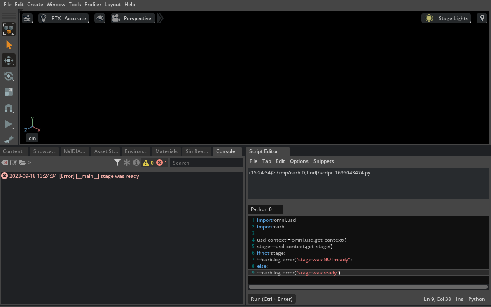

# Context, Stage and Layers

A `stage` in USD is the final composed result of opening one or more layers. Again on the Photoshop analogy: all image layers compose a final image. A stage references one or more layers and use them to compose a 3D scene.

Stage objects are owned by a USD `context`: a USD `context` is usually provided by the application you're working in (e.g. python or C++ code running in an Omniverse extension can use something like `omni.usd.get_context()` to get the current active context) and is a container for resources and internal states needed by the stages. Multiple contexts can be created at the same time (or a context can be manually destroyed via code):

```python
# Check if we already have a valid context when this code executes, or create one if there's none
usd_context = omni.usd.get_context()
if not usd_context:
    print("Context was not ready, creating one..")
    usd_context = omni.usd.create_context()
```

This snippet uses APIs provided by Kit and not available outside of Omniverse Kit (i.e. contexts are usually managed by applications which use OpenUSD libraries), in particular this API is provided by the [omni.usd](https://docs.omniverse.nvidia.com/kit/docs/omni.usd/latest/omni.usd/omni.usd.UsdContext.html) extension.

In the [Hello USD](../chapter1/hello_usd.md) section we used asynchronous routines to make sure a stage would be ready after we loaded up a `.usda` file, if we had executed a python script at startup with the same shell invocation

```shell
~/.local/share/ov/pkg/create-2023.2.0$ ./kit/kit ./apps/omni.minimal.kit --exec ./main.py
```

with just a stage check like this:

```python
import omni.usd
import carb

usd_context = omni.usd.get_context()
stage = usd_context.get_stage()
if not stage:
    carb.log_error("stage was NOT ready")
else:
    carb.log_error("stage was ready")
```

we would have found out that by the time our script is executed (i.e. after Kit is loaded and all of the extension dependencies have been loaded), there should already be a context provided by Kit but probably no stage is loaded yet (a blank stage or a blank template stage is loaded shortly afterwards, but it might not be ready by the time we execute the code above).

We would have had both (a valid context and a valid stage) if we had executed the script above in USD Composer directly by using the `Script Editor` extension (you can activate this in `Window->Script Editor` - if you can't find this make sure the extension is downloaded and activated from `Window->Extensions`.. in Omniverse _everything is an extension_).




```admonish warning
Executing code in Kit by providing a .py file from the command line and/or using the script editor means you can make a lot of assumptions which are no longer valid when you're developing your own Omniverse Kit extension. Extensions must pay attention to the availability of the resources they intend to use (e.g. do not assume there's already a stage you can play with).
```

## Ownership of USD stages

USD contexts are also the sole owners of a stage created in it or attached to it. Everything else referencing a stage should be a weakref (non-owning reference), this is by design to prevent leaking stages (which can get quite big).

Let's see an example of this:

```python
from pxr import Sdf, Usd, UsdUtils
import omni.usd

# 1
usd_context = omni.usd.get_context()
old_stage = usd_context.get_stage()
print(old_stage)  # Valid stage

# 2
layer = Sdf.Layer.CreateAnonymous()
new_stage = Usd.Stage.CreateInMemory(layer.identifier)
print(old_stage)  # Stage is still valid here

# 3
cache = UsdUtils.StageCache.Get()
stage_id = cache.Insert(new_stage).ToLongInt()
usd_context.attach_stage_with_callback(stage_id, None)
print(old_stage)  # Old stage is NO LONGER valid here
```

Executing the code above in the `Script Editor` prints something like the following

```
(19:06:08)> /tmp/carb.VUw057/script_169285425.py
Usd.Stage.Open(rootLayer=Sdf.Find('anon:0x107afbd0:World0.usd'), sessionLayer=Sdf.Find('anon:0x107afe00:World0-session.usda'), pathResolverContext=<invalid repr>)
Usd.Stage.Open(rootLayer=Sdf.Find('anon:0x107afbd0:World0.usd'), sessionLayer=Sdf.Find('anon:0x107afe00:World0-session.usda'), pathResolverContext=<invalid repr>)
invalid null stage
```

plus you should see OV Composer reloading a blank stage.

The code does the following:

1. The current context is obtained via `omni.usd` API (Kit proprietary - this is not standard OpenUSD), the current stage is obtained from the current context (this assumes there's a stage already, just like the blank scene you're presented in OV Composer at startup) and printed for debugging purposes
2. A new anonymous layer is created. A layer is usually backed by a USD file, except for anonymous layers: these are layers used for debugging and/or storing runtime data for extensions. In this case we're using an anonymous layer (so we avoid having it backed by a file) to create an in-memory stage and using that anonymous layer as the `root layer` (think of it as the starting layer for a stage, we'll revisit this later). The gist of this part is that we're creating a stage entirely in memory and ephemerally. The old stage reference is printed and it's still valid (the context still has the old stage attached).
3. Now we use an OpenUSD facility called the `StageCache`: this is a cache exposed by USD since stages can get pretty expensive after loading tons of resources and computing the final rendering results of lots and lots of layers, therefore stages can be cached and reused. In this demonstrative example we use this facility to insert the new stage we manually created into the fold and we finally attach it to the current USD context provided by Kit: this causes Kit to switch to the new empty stage. Finally we print the `old_stage` reference: now we get the `null stage`. Keep in mind that the `StageCache` API is exposed by USD as meant to be used by higher-level facilities (like Kit) to manage multiple stages themselves (i.e. you probably shouldn't dabble with this unless you know what you're doing).

The behavior we just observed is in accordance to what we wrote at the beginning:

```admonish quote
USD contexts are also the sole owners of a stage created in it or attached to it
```

If we had kept another reference to the old stage, we would have seen the following:

```python
from pxr import Sdf, Usd, UsdUtils
import omni.usd

usd_context = omni.usd.get_context()
old_stage = usd_context.get_stage()
old_stage = Usd.Stage.Open(old_stage.GetRootLayer().identifier)  # Keep a reference to the old stage alive!
print(old_stage)  # Valid stage

layer = Sdf.Layer.CreateAnonymous()
new_stage = Usd.Stage.CreateInMemory(layer.identifier)
print(old_stage)  # Stage is still valid here

cache = UsdUtils.StageCache.Get()
stage_id = cache.Insert(new_stage).ToLongInt()
usd_context.attach_stage_with_callback(stage_id, None)
print(old_stage)  # Still valid here!
```

```
(19:06:08)> /tmp/carb.VUw057/script_169285425.py
Usd.Stage.Open(rootLayer=Sdf.Find('anon:0x107afbd0:World0.usd'), sessionLayer=Sdf.Find('anon:0x107afe00:World0-session.usda'), pathResolverContext=<invalid repr>)
Usd.Stage.Open(rootLayer=Sdf.Find('anon:0x107afbd0:World0.usd'), sessionLayer=Sdf.Find('anon:0x107afe00:World0-session.usda'), pathResolverContext=<invalid repr>)
Usd.Stage.Open(rootLayer=Sdf.Find('anon:0x107afbd0:World0.usd'), sessionLayer=Sdf.Find('anon:0x107afe00:World0-session.usda'), pathResolverContext=<invalid repr>)
```

even though we attached another stage to the USD context to own. This is usually not recommended as USD contexts should be the objects delegated to managing stages.

## Layers

We will revisit layers later on multiple times, but for now a quick introduction linked to what we've just learned can be beneficial.
Layers in USD are collections of `prims` (short for _primitive_ in USD, for instance: a cube mesh) and their `properties` (for instance: the cube mesh' display color) that can be saved to or loaded from disk or memory ([book of USD](https://remedy-entertainment.github.io/USDBook/terminology/layer.html) defines them as "saveable hierarchy" which is an apt term for it).

Much like Photoshop layers, each layer can add to or override some properties defined in the layers below it. Each scene, as we've already seen, has a `Root Layer`, i.e. a main layer (backed by a USD file as well) on which the stage is initially opened. It is also the **strongest override layer** (except for a special layer called `session layer` which is like a scratch space for Kit and it's by default hidden to the users), i.e. the layer where the 'opinions' on a prim property count more than all of its sublayers.

Prims can be `def`ined in a layer and have `over`ridden properties in another:

```admonish info


Note the small white triangle on `World` and `Cube` under `layer3.usda`: that symbol is a `delta` and indicates that only changed properties were registered in that layer and the entire assets were **not** completely duplicated
```

```shell
$ cat layer2.usda
#usda 1.0
(
    customLayerData = {
        ...
    }
)

def Xform "World"
{
    def Mesh "Cube"
    {
        double3 xformOp:translate = (-255.80417243728027, 0, 0)
        ...
    }
}

$ cat layer3.usda
#usda 1.0
(
    upAxis = "Y"
)

over "World"
{
    over "Cube"
    {
        double3 xformOp:translate = (177.0296449279361, 0, 0)  <---- overrides this property for the prim /World/Cube
        ...
    }
}
```

Also note that in the hierarchy above `layer3` is positioned **above** `layer2` and therefore has a stronger opinion on the `xformOp:translate` property (which corresponds to the position of the prim) - layer3 is gonna win and place the cube at `(177.0296449279361, 0, 0)`.
The idea would be that `layer2` defines a 3D model created by an artist who is still working out some parts of it, the Omniverse Nucleus service has already synchronized the file with the local OV Composer copy of another scene artist who decided that the 3D model looks better moved from `(-255.80417243728027, 0, 0)` to `(177.0296449279361, 0, 0)` and authored this property in `layer3`. This is an example of a _non-destructive_ workflow: properties are changed, added and overridden without destroying the underlying layers. Artists, programmers, simulation engineers and whatnot can still work together within a USD scene by ensuring only their deltas are applied (and, eventually at the end of the work, maybe all changes _flattened_ in the root layer, i.e. re-unifying all deltas and just getting everything together in the single layer which is the root layer).

Layers allow to create a gigantic amount of scenes without eating up a lot of space by reusing assets and just operating on changing properties via deltas.

```admonish info
🐧 USD is a bit like `git` for computer graphics.
```

In the next sections we'll take a deeper look at layers and their internal representations.