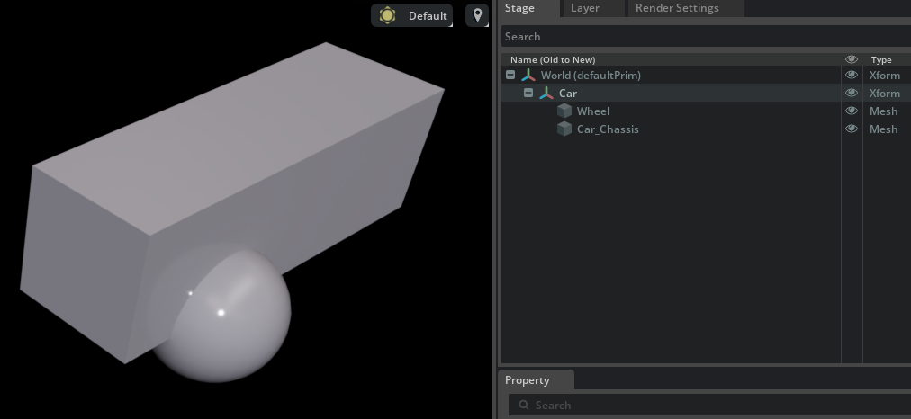
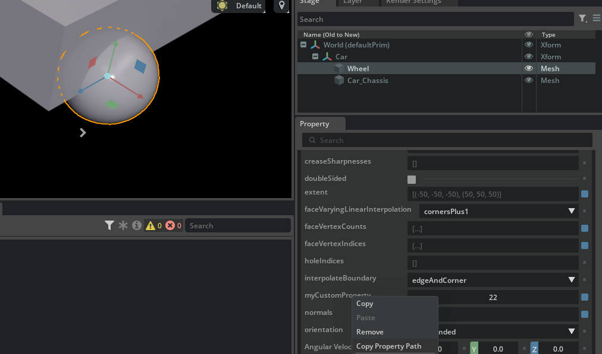

# Prims and Properties

## Prims

A `prim` (short for _primitive_) is a _dictionary_ of key-value pairs. Prims are the main components of a USD scene graph which gets composed from a stage after assembling all of the layers, resolving their opinions and deciding which final value a prim gets for e.g. its scaling or translation or rotation values.

Prims are hierarchical in the scene so you can have a `wheel` prim and a `car_chassis` prim and each one of those meshes containing: in their key field `points` the XYZ coordinates of each vertex for the mesh, in the `faceVertexCounts` the number of points composing each face, in `faceVertexIndices` the indices for each vertex so the face can have a face-up face-down orientation, the `normals` for each vertex, etc..

```python
def Xform "World"
{
    def Xform "Car"
    {
        double3 xformOp:rotateXYZ = (0, 0, 0)
        double3 xformOp:scale = (1, 1, 1)
        double3 xformOp:translate = (0, 0, 0)
        uniform token[] xformOpOrder = ["xformOp:translate", "xformOp:rotateXYZ", "xformOp:scale"]

        def Mesh "Wheel"
        {
            float3[] extent = [(-50, -50, -50), (50, 50, 50)]
            int[] faceVertexCounts = [3, 3, ...a lot of values...]
            int[] faceVertexIndices = [0, 1, 2, 0,....]
            normal3f[] normals = [(0, -50, 0),...](
                interpolation = "faceVarying"
            )
            point3f[] points = [(0, -50, 0), ...]
            texCoord2f[] primvars:st = [(1, 0), (1, 0.0625), ...]
             (
                interpolation = "faceVarying"
            )
            uniform token subdivisionScheme = "none"
            double3 xformOp:rotateXYZ = (0, 0, 0)
            double3 xformOp:scale = (1, 1, 1)
            double3 xformOp:translate = (46.61611128680149, -2.08943043408906, 63.14526081950993)
            uniform token[] xformOpOrder = ["xformOp:translate", "xformOp:rotateXYZ", "xformOp:scale"]
        }

        def Mesh "Car_Chassis"
        {
            float3[] extent = [(-50, -50, -50), (50, 50, 50)]
            int[] faceVertexCounts = [4, 4, ...]
            int[] faceVertexIndices = [0, 1, 3, ...] (
                interpolation = "faceVarying"
            )
            point3f[] points = [(-50, -50, 50), ...]
            texCoord2f[] primvars:st = [(0, 0), ...] (
                interpolation = "faceVarying"
            )
            uniform token subdivisionScheme = "none"
            double3 xformOp:rotateXYZ = (0, 0, 0)
            double3 xformOp:scale = (1, 1, 3.1101341016510786)
            double3 xformOp:translate = (0, 50, 0)
            uniform token[] xformOpOrder = ["xformOp:translate", "xformOp:rotateXYZ", "xformOp:scale"]
        }
    }
}
```



Prims can have types and much more too:

```python
def Mesh "Car_Chassis" (apiSchemas = ["GiveThisPrimPropertiesToBehaveAsAMetalPiece"])
#1   #2       #3        #4
```

1. `specifier` (whether this is a prim definition, an OVERride to override properties of another prim, etc.)
2. `type`, this is the type of the prim (e.g. Mesh, Xform, DomeLight, etc..)
3. `name` - this is the name (part of the SdfPath so it cannot contain spaces) of the prim
4. prim `metadata`, API schemas, references, variantsets, etc. are specified here, together with user-defined metadata in a predefined dictionary here (i.e. `customData`)

A mesh is a type of prim meant to store render-able data (points, normals, maybe UV coords, etc.), an xform prim stores a transform matrix that applies to its child prims (that can be the identity prim - in that case the xform prim name can be useful to group other prims and have a name that is meaningful to human readers/artists, much like the `Car` xform prim that we used in the image above to group together the wheel and the car chassis), etc.

## Properties

Properties are the key+value pairs that are contained in prims (e.g. `normals` is a property in the prims above, or maybe a `radius` can be a property of a sphere prim).

There are two types of properties:

* **Attributes**: `normals` and `radius` fall in this category: key-value pairs with well-defined values (e.g. a `float3` or a `double`). Attributes can be time-sampled, i.e. they can vary over time (so USD supports the concept of animations as well).

    ```python
    def Sphere "Sphere"
    {
        float3[] extent = [(-30, -30, -30), (30, 30, 30)] # an attribute (not time-sampled)
        double radius = 50 # another attribute
        double radius.timeSamples = { # a time-sampled attribute
            1: 1, # set the sphere with a radius of 1 at frame time 1
            50: 50, # and with a radius of 50 at frame time 50
        } # the above values will be linearly interpolated by default
    }
    ```

* **Relationships**: the classical example here is a _material binding_ where a prim has a relationship property (currently not time sampled)

    ```python
    def Xform "World"
    {
        def Mesh "Cube" (
            prepend apiSchemas = ["MaterialBindingAPI"]
        )
        {
            float3[] extent = [(-50, -50, -50), (50, 50, 50)]
            int[] faceVertexCounts = [4, 4, 4, 4, 4, 4]
            int[] faceVertexIndices = [0, 1, 3, 2, 4, 6, 7, 5, 6, 2, 3, 7, 4, 5, 1, 0, 4, 0, 2, 6, 5, 7, 3, 1]
            rel material:binding = </World/Materials/SimpleRedSurface> (  # This is a relationship property!
                bindMaterialAs = "weakerThanDescendants"
            )
        }

        def Scope "Materials"
        {
            def Material "SimpleRedSurface"
            {
                token outputs:displacement.connect = </World/Materials/SimpleRedSurface/Shader.outputs:displacement>
                token outputs:surface.connect = </World/Materials/SimpleRedSurface/Shader.outputs:surface>

                def Shader "Shader"
                {
                    uniform token info:id = "UsdPreviewSurface"
                    color3f inputs:diffuseColor = (1, 0, 0) (  # Red color
                        customData = {
                            float3 default = (0.18, 0.18, 0.18)
                        }
                        hidden = false
                        renderType = "color"
                    )
                }
            }
        }
    }
    ```

    The `material:binding` relationship is defined in the [`UsdShadeMaterialBindingAPI`](https://openusd.org/dev/api/class_usd_shade_material_binding_a_p_i.html) so it's part of a schema as well for all those prims which are meant to have a material applied to them.

Sometimes "properties" and "attributes" are used somewhat interchangeably in USD code and documentations, but it's important to know the difference (properties include relationships as well).

Prims can also have custom properties too (something that maybe holds meaning for a 3D modeling program) and those properties can (or can not) be part of a `Schema` (e.g. a prim with a `CollisionAPI` schema will have physical properties like `contactOffset` or similar physics-specific ones). In this example we have a prim with a `MyCustomSchemaAPI` applied (a schema that might be owned by our own Omniverse extension), a custom attribute and some custom metadata applied to the generated prim as well

```python
def Mesh "Wheel" (
    prepend apiSchemas = ["PhysicsRigidBodyAPI", ... , "MyCustomSchemaAPI"]
    customData = {
        string thisIsMyCustomOmniverseExtensionMetadata = "This great prim was created by MyExtension v1.0"
    }
)
{
    float3[] extent = [(-50, -50, -50), (50, 50, 50)]
    int myCustomProperty = 22
    ...
}
```

Both prims and properties are identified by unique SdfPaths: examples for the above are

```
/World/Car/Wheel
/World/Car/Wheel.myCustomProperty
/World/Car/Wheel.material:binding
```

OV Composer has a handy property visualization pane which summarizes all properties of a prim and allows you to also copy the full SdfPaths by simply right-clicking on a visualized property



