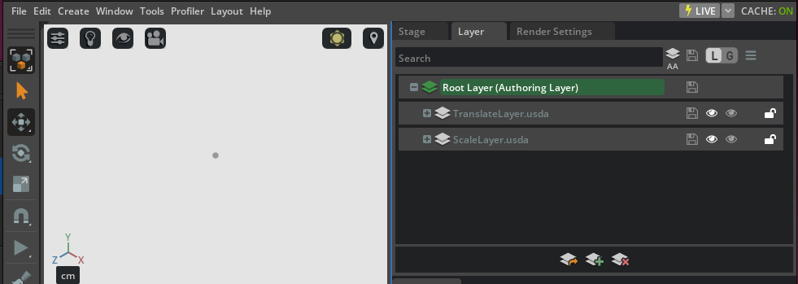
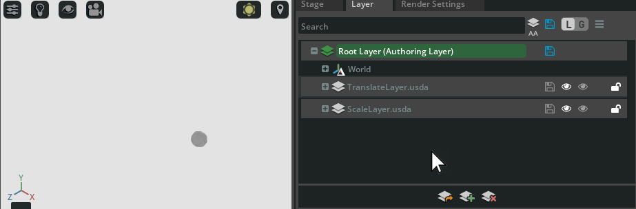

# Sublayers: authoring time-sampled attributes

Before we proceed further let's take a look at an example of what we've learned so far: we will generate through Python code multiple USD layers, save them to three different `.usda` files, compose them on a stage and use different time-sampled attributes to demonstrate how one property in a layer can be overridden in another stronger layer.

```python
from pxr import Sdf, UsdGeom, Usd, UsdLux, Gf
import omni.usd
import carb

BASE_DIRECTORY = "/tmp"  # This is where the .usda files will be saved

# Create a temporary stage in memory for the root layer, the scale layer and the translate layer
root_stage : Usd.Stage = Usd.Stage.CreateInMemory("RootLayer.usda")
scale_stage : Usd.Stage = Usd.Stage.CreateInMemory("ScaleLayer.usda")
translate_stage : Usd.Stage = Usd.Stage.CreateInMemory("TranslateLayer.usda")

# Add stage metadata to inform OV Composer that it should set up a timeline from timecode 0 to timecode 50,
# roughly at 30 fps
root_stage.SetStartTimeCode(0)
root_stage.SetEndTimeCode(50)
root_stage.SetTimeCodesPerSecond(30)

# Create a Xform "World" and a Sphere "Sphere" prim in the scale stage

xform : UsdGeom.Xform = UsdGeom.Xform.Define(scale_stage, Sdf.Path("/World"))
# Overly verbose way of getting "/World" SdfPath to demonstrate API usage
sphere : UsdGeom.Sphere = UsdGeom.Sphere.Define(scale_stage, Sdf.Path(str(xform.GetPrim().GetPath()) + "/Sphere"))
# Set the extent of the sphere
extent = [(-30, -30, -30), (30, 30, 30)]
sphere.GetExtentAttr().Set(extent)
# Set the radius of the sphere
radius = sphere.GetRadiusAttr()
radius.Set(50) # Set as not timesampled
radius.Set(1, 1) # Set as timesampled at timesample 1
radius.Set(50, 50) # Set as timesampled at timesample 50

# Also create a DomeLight on the scale stage to be actually able to see the cube in OV Composer
# (otherwise it's gonna be pitch black)

# Create an Xform named "Environment"
environment_xform = UsdGeom.Xform.Define(scale_stage, "/Environment")
# Create a DomeLight named "DomeLight" within "Environment"
dome_light = UsdLux.DomeLight.Define(scale_stage, "/Environment/DomeLight")
# Set DomeLight attributes
dome_light.CreateIntensityAttr(1000)

# Now create some overrides in the translate stage

sphere_override_prim = translate_stage.OverridePrim("/World/Sphere")
sphere_override : UsdGeom.Sphere = UsdGeom.Sphere(sphere_override_prim) # Treat this as a UsdGeom.Sphere
# Define radius.timeSamples as not varying (always the same) - note that an override has no type
# so we cannot assume that the "type Sphere" schemas are applied - we have to create those attributes
# ourselves so they can override whatever attribute will be found when composing these layers
radius = sphere_override.CreateRadiusAttr()
radius.Set(10, 1)
radius.Set(10, 50)
# Define xformOp:translate.timeSamples as varying!
translate_op = UsdGeom.Xform(sphere_override).AddTranslateOp()
translate_op.Set(Gf.Vec3d(0.0, 0.0, 0.0), 0)
translate_op.Set(Gf.Vec3d(150.0, 0.0, 0.0), 50)

# Export scale and translate layers to file
scale_stage.GetRootLayer().Export(BASE_DIRECTORY + "/ScaleLayer.usda")
translate_stage.GetRootLayer().Export(BASE_DIRECTORY + "/TranslateLayer.usda")

# Add the translate stage and the scale stage as sublayers to the root layer in the root stage
# Note: this would be wrong since it'll make a reference to the in-memory anonymous layer
# '@anon:0x2a0052e0:TranslateLayer.usda@' which will be freed when this interpreter exits
#   root_stage.GetRootLayer().subLayerPaths.append(scale_stage.GetRootLayer().identifier)
# This is instead correct to reference a serialized layer on file (i.e. '@/tmp/TranslateLayer.usda@')
root_stage.GetRootLayer().subLayerPaths.append(BASE_DIRECTORY + "/TranslateLayer.usda")
# also add the scale stage AFTER the translate layer - ORDER IS IMPORTANT HERE!
root_stage.GetRootLayer().subLayerPaths.append(BASE_DIRECTORY + "/ScaleLayer.usda")

# Optional for demonstrative purposes: set the default prim to a prim in another layer
root_stage.SetDefaultPrim(xform.GetPrim())

# Export root layer to file
root_stage.GetRootLayer().Export(BASE_DIRECTORY + "/RootLayer.usda")
```

This rather verbose code listing can be executed in the `Script Editor` in OV Composer. If everything works correctly, you should have three `.usda` files in your `/tmp` directory:

* `RootLayer.usda` - this will be our root layer, we will open this file with OV composer and reference the others through this.
* `TranslateLayer.usda` - this will be the **first** (**ORDER IS IMPORTANT**) sublayer and it will contain a time-sampled override of the `radius` property (which will not change from timecodes 0 to 50) and a time-sampled override of the `translate` property (which _will_ change continuously moving the sphere on the X axis when time flows from timecode 0 to 50).
* `ScaleLayer.usda` - this will be the **second** sublayer and it will contain the definitions of the prims in the scene (i.e. the `World` xform, the `Sphere` sphere and the `DomeLight` light prim will be _defined_ in this layer), plus there will be a time-sampled definition of the `radius` property which will make the sphere grow from a small radius to a huge radius in 50 timecodes.

```admonish warn
The opinion in a containing layer is always stronger than any opinions in its sublayers. E.g. the opinion for a property in the root layer is always stronger than any opinion for the same property in any sublayers of that root layer.
```

If you now try to open `RootLayer.usda` in OV composer you will see three layers and a _very small_ ball on the white-lit viewport:



Note that the `Root Layer` is set as the `Authoring Layer`, i.e. if you try to make modifications to the scene (e.g. changing the scale of the sphere), a _delta_ will be added to the root layer (and written to the `RootLayer.usda` file if you save it). The reason for this is that the `/World/Sphere` prim is _defined_ (i.e. there is a `def` specifier directive in the ASCII text `.usda` file) in the `ScaleLayer.usda`: it is **not** defined in the current root layer, so if we modify anything in the scene and we force modifications to go to the `Root Layer`, they will be written there as a delta, i.e. the root layer will have a _stronger opinion_ on those properties which will be either defined or defaulted to their default values in the defining `ScaleLayer`.

If we play the simulation in OV Composer we can see that the sphere slides on the X axis (we might have to move the camera to see it clearly or focus the view on the sphere prim by selecting it and pressing `F` in OV Composer) from a timecode from 0 to 50 (you can better visualize this in the `Window->Animation->Timeline` pane, you can even right-click on properties in the `Property` pane and select `Set Key` to "store" that value in the currently selected keyframe).

```admonish tip
One side thing to note here: a `Sphere` prim type is different than a prim sphere of `Mesh` type, similarly a `Cube` prim type is different than a cube prim of `Mesh` type: a `Mesh` is just a collection of points rendered together while `Sphere`, `Torus`, `Cube` and some others are primitive prim types provided by USD and that have built-in properties that make sense for the shape in question (e.g. the `radius` property for the `Sphere` type). We could have structured our code above with a sphere of `Mesh` type but it would have been consideraly harder and more verbose because of all the `points`, `normals`, etc. boilerplate. For clarity reasons, we chose to use a `Sphere` prim type.
```

What's interesting to see at this point is that if we run the simulation continuously and we **mute** the `TranslateLayer` (which is _higher_ in the layers hierarchy under the root layer), the _muted_ opinions disappear and USD recomposes the scene graph by updating all of the overriden properties: now the `ScaleLayer` has the winning opinion for the `translate` and, most importantly, `radius` property!



At this point you should have developed a pretty good sense of what can be accomplished with USD: non-destructive workflows, multiple scenes editing and a strongly typed and extensible system which enables applications to leverage graphical capabilities that weren't possible before.
