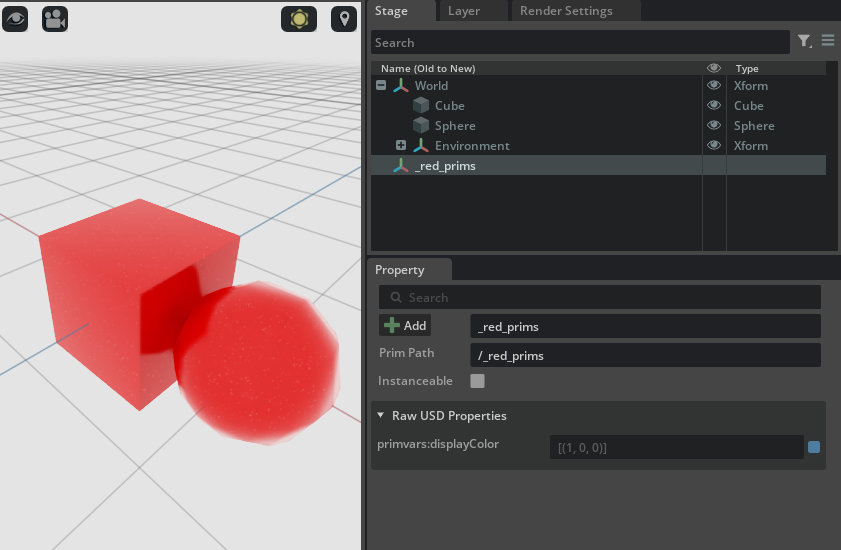

# Inherits

Let's take a look at an example where a prim with a `class` specifier (you can find this in the `.usda` text file in the same prim definition lines where you used to read `def` or `over`: the `class` specifier indicates that a prim is to be considered as a _base class_ for other prims) is inherited by other prims. A prim can inherit from multiple other prims at the same time.

```python
from pxr import Sdf, UsdGeom, Usd, UsdLux, Gf
import omni.usd
import carb

BASE_DIRECTORY = "/tmp"  # This is where the .usda files will be saved

root_stage : Usd.Stage = Usd.Stage.CreateInMemory("RootLayer.usda")

# Add a cube and a sphere to the scene

xform : UsdGeom.Xform = UsdGeom.Xform.Define(root_stage, Sdf.Path("/World"))
cube : UsdGeom.Cube = UsdGeom.Cube.Define(root_stage, "/World/Cube")
extent = [(-50, -50, -50), (50, 50, 50)]
cube.GetExtentAttr().Set(extent)
cube.GetSizeAttr().Set(100)
sphere : UsdGeom.Sphere = UsdGeom.Sphere.Define(root_stage, "/World/Sphere")
sphere.GetExtentAttr().Set(extent)
# Just to beautify the scene: move the sphere a bit and scale it
UsdGeom.Xformable(sphere.GetPrim()).AddTranslateOp().Set(Gf.Vec3d(100, 0, 0))
UsdGeom.Xformable(sphere.GetPrim()).AddScaleOp().Set(Gf.Vec3d(50, 50, 50))
environment_xform = UsdGeom.Xform.Define(root_stage, "/World/Environment")
dome_light = UsdLux.DomeLight.Define(root_stage, "/World/Environment/DomeLight")
dome_light.CreateIntensityAttr(1000)

# The base class for all red prims: adds a red color `primvars:displayColor` attribute
red_prims : Usd.Prim = root_stage.CreateClassPrim("/_red_prims")
red_prims.CreateAttribute("primvars:displayColor", Sdf.ValueTypeNames.Color3fArray).Set([(1.0, 0.0, 0.0)])

# Make both the sphere and the cube inherit from the _red_prims class prim
inherits: Usd.Inherits = cube.GetPrim().GetInherits()
inherits.AddInherit(red_prims.GetPath())

inherits: Usd.Inherits = sphere.GetPrim().GetInherits()
inherits.AddInherit(red_prims.GetPath())

# Export root stage to file
root_stage.GetRootLayer().Export(BASE_DIRECTORY + "/RootLayer.usda")

# Issue an 'open-stage' command to avoid doing this manually and free whatever stage
# was previously owned by this context
omni.usd.get_context().open_stage(BASE_DIRECTORY + "/RootLayer.usda")
```

This will make both the cube and the sphere prims inherit from the `_red_prims` class prim, causing them both to inherit the opinion for the color attribute



This is the generated USDA for the stage, note the `inherits` metadata for the derived prims and the `class` specifier for the `_red_prims`

```python
$ cat /tmp/RootLayer.usda
#usda 1.0

def Xform "World"
{
    def Cube "Cube" (
        prepend inherits = </_red_prims>
    )
    {
        float3[] extent = [(-50, -50, -50), (50, 50, 50)]
        double size = 100
    }

    def Sphere "Sphere" (
        prepend inherits = </_red_prims>
    )
    {
        float3[] extent = [(-50, -50, -50), (50, 50, 50)]
        float3 xformOp:scale = (50, 50, 50)
        double3 xformOp:translate = (100, 0, 0)
        uniform token[] xformOpOrder = ["xformOp:translate", "xformOp:scale"]
    }

    def Xform "Environment"
    {
        def DomeLight "DomeLight"
        {
            float inputs:intensity = 1000
        }
    }
}

class "_red_prims"
{
    custom color3f[] primvars:displayColor = [(1, 0, 0)]
}
```
