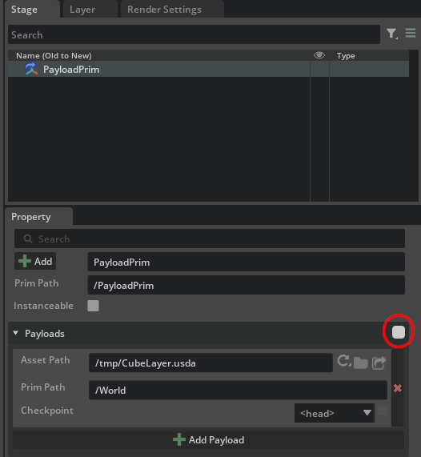

# Payload

Let's explore an example for payloads: reference-like arcs which can be loaded on demand and meant to be used with optional or resources-heavy assets.

```python
from pxr import Sdf, UsdGeom, Usd, UsdLux, Gf
import omni.usd
import carb

BASE_DIRECTORY = "/tmp"  # This is where the .usda files will be saved

# Create the usual cube stage, let's pretend this is a VERY HEAVY USD stage
# full of high-poly high-textured huge assets

cube_stage : Usd.Stage = Usd.Stage.CreateInMemory("CubeLayer.usda")
xform : UsdGeom.Xform = UsdGeom.Xform.Define(cube_stage, Sdf.Path("/World"))
cube : UsdGeom.Cube = UsdGeom.Cube.Define(cube_stage, "/World/Cube")
extent = [(-50, -50, -50), (50, 50, 50)]
cube.GetExtentAttr().Set(extent)
cube.GetSizeAttr().Set(100)
# This time put the light under the "/World" prim - by referencing "/World" we will also
# import the lights as well since they're under "/World"
environment_xform = UsdGeom.Xform.Define(cube_stage, "/World/Environment")
dome_light = UsdLux.DomeLight.Define(cube_stage, "/World/Environment/DomeLight")
dome_light.CreateIntensityAttr(1000)
# Do not define a defaultPrim - read more about this later
# cube_stage.SetDefaultPrim(xform.GetPrim())
# Export to file
cube_stage.GetRootLayer().Export(BASE_DIRECTORY + "/CubeLayer.usda")

# Create the root stage with a payload prim referencing the "heavy" cube stage

root_stage : Usd.Stage = Usd.Stage.CreateInMemory("RootLayer.usda")
payload_prim : Usd.Prim = root_stage.DefinePrim("/PayloadPrim")
loaded_layer = Sdf.Layer.FindOrOpen(BASE_DIRECTORY + "/CubeLayer.usda")
# Note that if we don't specify the target prim for the payload (i.e. "/World"), it will
# try to look for the 'defaultPrim' metadata in the loaded_layer (or fail to set a target if
# that metadata isn't even present). Layer-level metadata are just like prim metadata and are
# set at the beginning of a USD file between parentheses, e.g.
#
# $ cat ./usd_file.usda
# #usda 1.0
# (
#   defaultPrim = "/World"
# )
# ..
payload_prim.GetPayloads().AddPayload(loaded_layer.identifier, "/World")

# Export root stage to file
root_stage.GetRootLayer().Export(BASE_DIRECTORY + "/RootLayer.usda")

# Issue an 'open-stage' command to avoid doing this manually and free whatever stage
# was previously owned by this context
# Note the 'LOAD_NONE' which instructs Kit NOT to open Payloads.
omni.usd.get_context().open_stage(BASE_DIRECTORY + "/RootLayer.usda", load_set=omni.usd.UsdContextInitialLoadSet.LOAD_NONE)
```

Pay attention to the named parameter `load_set=omni.usd.UsdContextInitialLoadSet.LOAD_NONE` that we added to the kit `open_stage` invocation: that instructs Kit to NOT load stage payloads during opening (otherwise it would have been loaded and resolved automatically).

If we run the code above in the `Script Editor` we'll see a blank stage with a payload prim. Loading the payload can happen either via code
```python
root_stage.Load("/PayloadPrim")
root_stage.Unload("/PayloadPrim")
```
or directly in the OV Composer UI through a checkbox which will triger the payload prim loading


