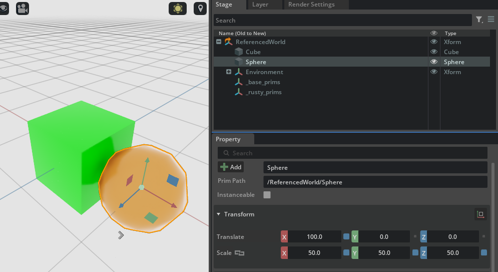

# Specializes

Understanding `specializes` requires a bit more work to build intuition. We've already said that it behaves similarly to `inherits` and that it has the weakest opinion strength in the `LIVRPS` ordering, but that it can prevent override of its attributes if the attributes in a base class are overridden.

To demonstrate this, let's take a look at a more complex example where `RootLayer.usda` defines a `/ReferencedWorld` prim which references entirely another USD file `CubeAndSphereLayer.usda`. Inside `CubeAndSphereLayer.usda` there are a cube and a sphere and they inherit from two different prims: `_base_prims` which gives all prims a base red color and `_rusty_prims` which give all prims a rust-like color (light brown-orange-ish). `_rusty_prims` is not a derived class of `_base_prims` but rather a `specializes` of it: this means that if the `_base_prims` class changes (e.g. by switching to a green color instead of a red color), the properties authored in `_rusty_prims` will **override** those in `_base_prims` (but any non-authored property will still be inherited). And that's exactly what happens in `RootLayer.usda`: the `_base_prims` class prim is overridden and the color set to green. This will cause the cube, which inherits from `_base_prims`, to have the opinion overridden and change color to green. The sphere instead, which inherited from `_rusty_prims`, will **not** care for the green color and remain rusty.

After executing the code below, inspecting the USDA files will probably be a lot more intuitive in understanding what's happening

```python
from pxr import Sdf, UsdGeom, Usd, UsdLux, Gf
import omni.usd
import carb

BASE_DIRECTORY = "/tmp"  # This is where the .usda files will be saved

# Add a cube and a sphere to a CubeAndSphereLayer stage

cube_and_sphere_stage : Usd.Stage = Usd.Stage.CreateInMemory("CubeAndSphereLayer.usda")

xform : UsdGeom.Xform = UsdGeom.Xform.Define(cube_and_sphere_stage, Sdf.Path("/World"))
cube : UsdGeom.Cube = UsdGeom.Cube.Define(cube_and_sphere_stage, "/World/Cube")
extent = [(-50, -50, -50), (50, 50, 50)]
cube.GetExtentAttr().Set(extent)
cube.GetSizeAttr().Set(100)
sphere : UsdGeom.Sphere = UsdGeom.Sphere.Define(cube_and_sphere_stage, "/World/Sphere")
sphere.GetExtentAttr().Set(extent)
UsdGeom.Xformable(sphere.GetPrim()).AddTranslateOp().Set(Gf.Vec3d(100, 0, 0))
UsdGeom.Xformable(sphere.GetPrim()).AddScaleOp().Set(Gf.Vec3d(50, 50, 50))
environment_xform = UsdGeom.Xform.Define(cube_and_sphere_stage, "/World/Environment")
dome_light = UsdLux.DomeLight.Define(cube_and_sphere_stage, "/World/Environment/DomeLight")
dome_light.CreateIntensityAttr(1000)

# The base class for all prims: adds a red color `primvars:displayColor` attribute
base_prims : Usd.Prim = cube_and_sphere_stage.CreateClassPrim("/World/_base_prims")
base_prims.CreateAttribute("primvars:displayColor", Sdf.ValueTypeNames.Color3fArray).Set([(1.0, 0.0, 0.0)])

# Make the cube inherit from the _base_prims class prim (so it gets a red color)
inherits: Usd.Inherits = cube.GetPrim().GetInherits()
inherits.AddInherit(base_prims.GetPath())

# Define a 'rusty_prims` prim which has an opinion for the color of rusty metal and SPECIALIZES (*not* inherits)
# the _base_prims prim
rusty_prims : Usd.Prim = cube_and_sphere_stage.DefinePrim("/World/_rusty_prims")
rusty_prims.CreateAttribute("primvars:displayColor", Sdf.ValueTypeNames.Color3fArray).Set([(0.718, 0.255, 0.055)])
specializes: Usd.Specializes = rusty_prims.GetSpecializes()
specializes.AddSpecialize(base_prims.GetPath())

# Make the sphere inherit from the _rusty_prims specialization prim
inherits: Usd.Inherits = sphere.GetPrim().GetInherits()
inherits.AddInherit(rusty_prims.GetPath())

# Export stage to file
cube_and_sphere_stage.GetRootLayer().Export(BASE_DIRECTORY + "/CubeAndSphereLayer.usda")


# Now create the RootLayer stage where the final scene will be composed: this will reference the entire CubeAndSphereLayer
# with ONE difference: it will have an override for the color of _base_prims-inheriting prims. This will cause all prims
# to get a green color EXCEPT for those inheriting from the rusty specialization!

root_stage : Usd.Stage = Usd.Stage.CreateInMemory("RootLayer.usda")

ref_prim : Usd.Prim = root_stage.DefinePrim("/ReferencedWorld")
loaded_layer = Sdf.Layer.FindOrOpen(BASE_DIRECTORY + "/CubeAndSphereLayer.usda")
ref_prim.GetReferences().AddReference(
    loaded_layer.identifier, # which in this case it's just the relative file path string
    "/World") # The prim which needs to be mapped at the ref_prim also needs to be specified

_base_prim_override = root_stage.OverridePrim("/ReferencedWorld/_base_prims")
_base_prim_override.CreateAttribute("primvars:displayColor", Sdf.ValueTypeNames.Color3fArray).Set([(0.0, 1.0, 0.0)])

root_stage.GetRootLayer().Export(BASE_DIRECTORY + "/RootLayer.usda")

# Issue an 'open-stage' command to avoid doing this manually and free whatever stage
# was previously owned by this context
omni.usd.get_context().open_stage(BASE_DIRECTORY + "/RootLayer.usda")
```



And here's the generated `.usda` files:

```python
$ cat /tmp/CubeAndSphereLayer.usda
#usda 1.0

def Xform "World"
{
    def Cube "Cube" (
        prepend inherits = </World/_base_prims>
    )
    {
        float3[] extent = [(-50, -50, -50), (50, 50, 50)]
        double size = 100
    }

    def Sphere "Sphere" (
        prepend inherits = </World/_rusty_prims>
    )
    {
        float3[] extent = [(-50, -50, -50), (50, 50, 50)]
        float3 xformOp:scale = (50, 50, 50)
        double3 xformOp:translate = (100, 0, 0)
        uniform token[] xformOpOrder = ["xformOp:translate", "xformOp:scale"]
    }

    def Xform "Environment"
    {
        def DomeLight "DomeLight"
        {
            float inputs:intensity = 1000
        }
    }

    class "_base_prims"
    {
        custom color3f[] primvars:displayColor = [(1, 0, 0)]
        # Added to showcases that specializes inherits whatever it does *not* override
        int someCustomProperty = 42;
    }

    def "_rusty_prims" (
        prepend specializes = </World/_base_prims>
    )
    {
        custom color3f[] primvars:displayColor = [(0.718, 0.255, 0.055)]
        # Note that this inherits someCustomProperty, and if that changes in _base_prims,
        # so it will here as well since we do _not_ have an overriding opinion on it.
    }
}

$ cat /tmp/RootLayer.usda
#usda 1.0

def "ReferencedWorld" (
    prepend references = @/tmp/CubeAndSphereLayer.usda@</World>
)
{
    over "_base_prims"
    {
        custom color3f[] primvars:displayColor = [(0, 1, 0)]
    }
}
```
