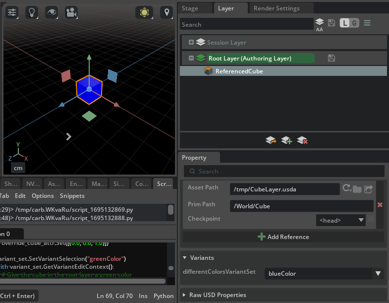

# VariantSet

Now let's see an example of `VariantSet` attribute override in action together with a `reference` attribute override and let's remember the `LIVRPS` order of opinions evaluation:

```python
from pxr import Sdf, UsdGeom, Usd, UsdLux, Gf
import omni.usd
import carb

BASE_DIRECTORY = "/tmp"  # This is where the .usda files will be saved

root_stage : Usd.Stage = Usd.Stage.CreateInMemory("RootLayer.usda")
cube_stage : Usd.Stage = Usd.Stage.CreateInMemory("CubeLayer.usda")

# Create a Cube "Cube" prim in the cube stage and a light

xform : UsdGeom.Xform = UsdGeom.Xform.Define(cube_stage, Sdf.Path("/World"))
cube : UsdGeom.Cube = UsdGeom.Cube.Define(cube_stage, "/World/Cube")
extent = [(-50, -50, -50), (50, 50, 50)]
cube.GetExtentAttr().Set(extent)
cube.GetSizeAttr().Set(100)
environment_xform = UsdGeom.Xform.Define(cube_stage, "/World/Environment")
dome_light = UsdLux.DomeLight.Define(cube_stage, "/World/Environment/DomeLight")
dome_light.CreateIntensityAttr(1000)
# In the cube layer (the one where the cube is defined and that will be referenced by RootLayer),
# the cube has originally a red color
cube.GetPrim().CreateAttribute("primvars:displayColor", Sdf.ValueTypeNames.Color3fArray).Set([(1.0, 0.0, 0.0)])
# Export to file
cube_stage.GetRootLayer().Export(BASE_DIRECTORY + "/CubeLayer.usda")

# Now as before set up a "/ReferencedCube" prim which references the "/World/Cube" in the CubeLayer

ref_prim : Usd.Prim = root_stage.DefinePrim("/ReferencedCube")
loaded_layer = Sdf.Layer.FindOrOpen(BASE_DIRECTORY + "/CubeLayer.usda")
ref_prim.GetReferences().AddReference(
    loaded_layer.identifier, # which in this case it's just the relative file path string
    "/World/Cube") # The prim which needs to be mapped at the ref_prim also needs to be specified

# At this point if graph composition were to end, the cube would just have an opinion in the referenced layer
# and would be a red colored one.

# This is where things get interesting: set up a variant set with sub-variants in the root layer
# (a VariantSet is like a new combo box to switch something in the prim, e.g. "colors for the car" or
# "level of damage of the car" or "types of wheel rims")
variant_set = ref_prim.GetVariantSets().AddVariantSet("differentColorsVariantSet")
# A variant is owned by a variant set, think of these as the different items that you can choose from the
# combo box (which is the VariantSet)
variant_set.AddVariant("blueColor")
variant_set.AddVariant("greenColor")

# Set the active variant
variant_set.SetVariantSelection("blueColor")
with variant_set.GetVariantEditContext():  # Set up an edit context (this is just like changing the authoring layer)
    # Give the cube in the root layer a blue color
    override_cube_prim : Usd.Prim = root_stage.OverridePrim("/ReferencedCube")
    override_cube_attr = override_cube_prim.CreateAttribute("primvars:displayColor", Sdf.ValueTypeNames.Color3fArray)
    override_cube_attr.Set([(0.0, 0.0, 1.0)])

variant_set.SetVariantSelection("greenColor")
with variant_set.GetVariantEditContext():
    # Give the cube in the root layer a green color
    override_cube_prim : Usd.Prim = root_stage.OverridePrim("/ReferencedCube")
    override_cube_attr = override_cube_prim.CreateAttribute("primvars:displayColor", Sdf.ValueTypeNames.Color3fArray)
    override_cube_attr.Set([(0.0, 1.0, 0.0)])

# Select the active variant after editing them
variant_set.SetVariantSelection("blueColor")

# Export root stage to file
root_stage.GetRootLayer().Export(BASE_DIRECTORY + "/RootLayer.usda")

# Issue an 'open-stage' command to avoid doing this manually and free whatever stage
# was previously owned by this context
omni.usd.get_context().open_stage(BASE_DIRECTORY + "/RootLayer.usda")
```

If you execute this code, you should get a reference prim but with a _blue_ color: even though the red color is authored and there's an opinion in the referenced layer, the `Variant` opinion is stronger in the `LIVRPS` ordering and therefore wins (note that OV Composer has a very handy combo box in the `Properties` pane that shows the `VariantSet` along with its current active `Variant`)



USDA code is also provided for completeness

```python
$ cat /tmp/RootLayer.usda
#usda 1.0

def "ReferencedCube" (
    prepend references = @/tmp/CubeLayer.usda@</World/Cube>
    variants = { # Active variants for multiple VariantSets are stored in the 'variants' metadata
        string differentColorsVariantSet = "blueColor"
    }
    prepend variantSets = "differentColorsVariantSet" # the additional VariantSets
)
{
    variantSet "differentColorsVariantSet" = { # Definition for the VariantSet which will override displayColor
        "blueColor" {
            color3f[] primvars:displayColor = [(0, 0, 1)]
        }
        "greenColor" {
            color3f[] primvars:displayColor = [(0, 1, 0)]
        }
    }
}

$ cat /tmp/CubeLayer.usda
#usda 1.0

def Xform "World"
{
    def Cube "Cube"
    {
        float3[] extent = [(-50, -50, -50), (50, 50, 50)]
        color3f[] primvars:displayColor = [(1, 0, 0)] # This opinion will be weaker due to LIVRPS composition
        double size = 100
    }

    def Xform "Environment"
    {
        def DomeLight "DomeLight"
        {
            float inputs:intensity = 1000
        }
    }
}

```