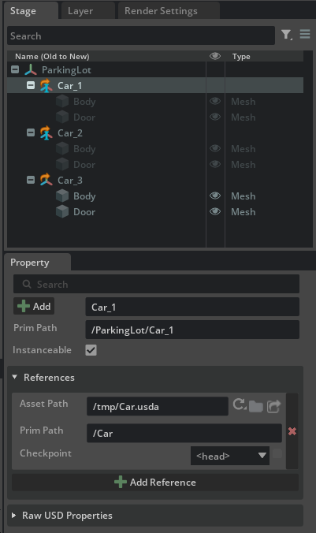
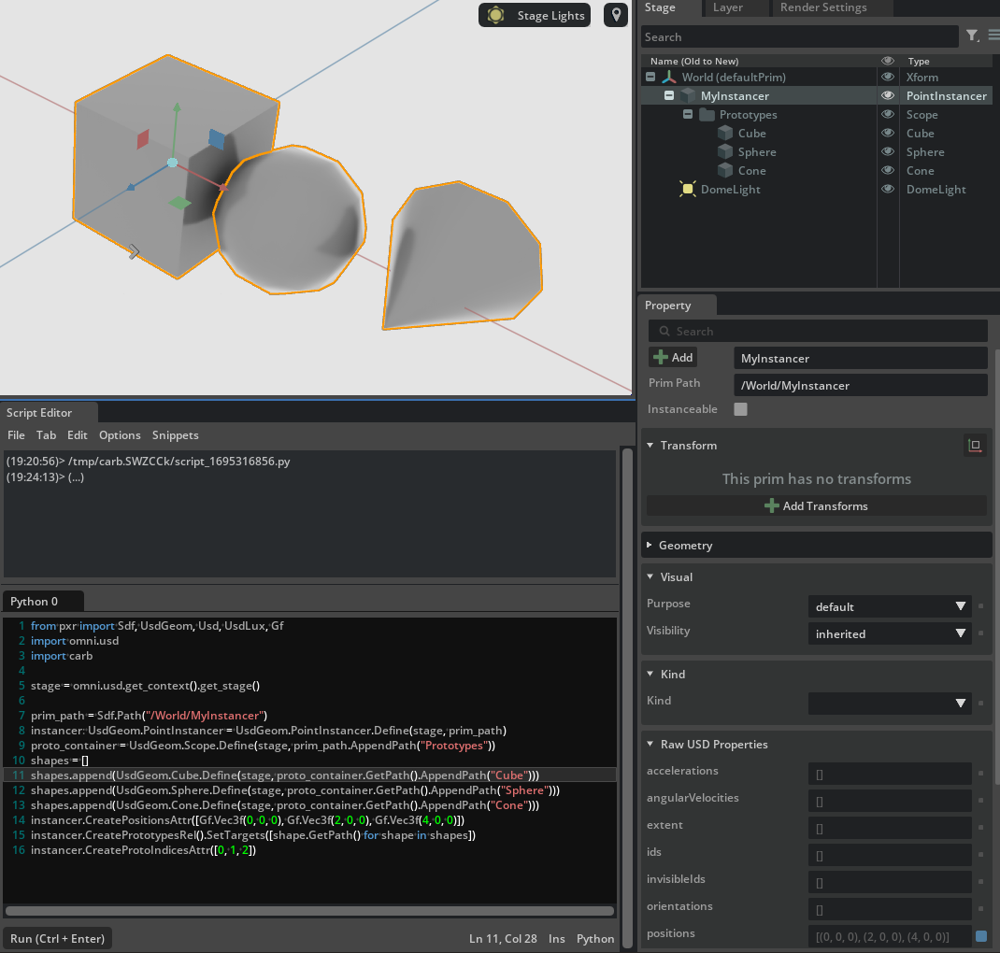

# Instancing

Instancing allows you to reuse parts of a USD hierarchy so that those parts get loaded into memory only once (reducing memory usage and increasing performances of your USD stage scene).

```admonish tip
The official OpenUSD documentation has a [pretty good chapter on instancing](https://openusd.org/release/api/_usd__page__scenegraph_instancing.html)
```

Let us create an example similar to the one found in the official docs: a `ParkingLot.usda` file and a `Car.usda` file: the idea is to only load the (pretend expensive) assets of `Car` once and reuse them for multiple cars in the `ParkingLot` scene.

```python
from pxr import Sdf, UsdGeom, Usd, UsdLux, Gf
import omni.usd
import carb

BASE_DIRECTORY = "/tmp"  # This is where the .usda files will be saved

parking_lot_stage : Usd.Stage = Usd.Stage.CreateInMemory("ParkingLot.usda")
car_stage : Usd.Stage = Usd.Stage.CreateInMemory("Car.usda")

# Car stage
xform : Usd.Prim = car_stage.DefinePrim(Sdf.Path("/Car"))
xform.GetPrim().CreateAttribute("color", Sdf.ValueTypeNames.Color3f).Set(Gf.Vec3f(0, 0, 0))
body : UsdGeom.Mesh = UsdGeom.Mesh.Define(car_stage, Sdf.Path("/Car/Body"))
body.GetPrim().CreateAttribute("color", Sdf.ValueTypeNames.Color3f).Set(Gf.Vec3f(0, 0, 0))
Door : UsdGeom.Mesh = UsdGeom.Mesh.Define(car_stage, Sdf.Path("/Car/Door"))
car_stage.GetRootLayer().Export(BASE_DIRECTORY + "/Car.usda")

# Parking Lot stage
xform : Usd.Prim = parking_lot_stage.DefinePrim(Sdf.Path("/ParkingLot"))
car1_prim : Usd.Prim = parking_lot_stage.DefinePrim("/ParkingLot/Car_1")
loaded_layer = Sdf.Layer.FindOrOpen(BASE_DIRECTORY + "/Car.usda")
car1_prim.GetReferences().AddReference(loaded_layer.identifier, "/Car")
car2_prim : Usd.Prim = parking_lot_stage.DefinePrim("/ParkingLot/Car_2")
loaded_layer = Sdf.Layer.FindOrOpen(BASE_DIRECTORY + "/Car.usda")
car2_prim.GetReferences().AddReference(loaded_layer.identifier, "/Car")
car3_prim : Usd.Prim = parking_lot_stage.DefinePrim("/ParkingLot/Car_3")
loaded_layer = Sdf.Layer.FindOrOpen(BASE_DIRECTORY + "/Car.usda")
car3_prim.GetReferences().AddReference(loaded_layer.identifier, "/Car")

# Mark with metadata Car_1 and Car_2 as instanceable, i.e. "these reference prims can be reused"
# while Car_3 is not marked
car1_prim.SetInstanceable(True)
car2_prim.SetInstanceable(True)

# Export root layer to file
parking_lot_stage.GetRootLayer().Export(BASE_DIRECTORY + "/ParkingLot.usda")
omni.usd.get_context().open_stage(BASE_DIRECTORY + "/ParkingLot.usda")
```

```python
$ cat /tmp/Car.usda && cat /tmp/ParkingLot.usda
#usda 1.0

def "Car"
{
    custom color3f color = (0, 0, 0)

    def Mesh "Body"
    {
        custom color3f color = (0, 0, 0)
    }

    def Mesh "Door"
    {
    }
}

#usda 1.0

def "ParkingLot"
{
    def "Car_1" (
        instanceable = true
        prepend references = @/tmp/Car.usda@</Car>
    )
    {
    }

    def "Car_2" (
        instanceable = true
        prepend references = @/tmp/Car.usda@</Car>
    )
    {
    }

    def "Car_3" (
        prepend references = @/tmp/Car.usda@</Car>
    )
    {
    }
}

```

Let's take a look at the stage in OV Composer



The icons in USD Composer help us identifying what a prim is made of: the orange/brown arrow on `Car_1` indicates that the prim has a reference to another prim (just as we saw before). The new part is the `I` icon which is present for `Car_1` and `Car_2` but not `Car_3`: this is the `I`nstanceable flag which is also exposed as a checkbox in the `Property` panel.

The user marks prims as _instanceable_ which means "everything referenced and below this prim can be reused if there are multiple prims that are resolved to use that very same location". The grayed out color means that no property can be changed for an instanceable prim (while prims under `Car_3` are normal non-instance prims so they can have their properties edited as usual). If you want to change some properties of instance prims you'll have to de-_instanceable_ the parent prim (that will make sure that you have a USD prim you can write to, but it'll cost more in terms of performances and memory, of course).

There are APIs to check if a prim is an instance or not ([`IsInstance`](https://openusd.org/release/api/class_usd_prim.html#a802acbcafc0625377d483931ec4fb202)) and even to query the `Prototypes`: a prototype prim is a special prim that gets created by the USD scene composition engine when there are _instanceable_ prims in the stage. It is invisible to the normal OV Composer stage panel since it's an internal USD detail and users aren't supposed to dabble with them and it gets usually created in root-paths like `/__Prototype_1` with internal names. They are treated specially because they represent, in this example, the `/Car` hierarchy which is read-only copied to all _instanceable_ prims referencing it. Prototypes are considered 'siblings' to the pseudo-root and have no metadata nor properties.

One could use the code below to query prototypes and perform other manipulations on instanceable prims (you can paste this in the `Script Editor` once the scene above has been created and opened)

```python
from pxr import Sdf, UsdGeom, Usd, UsdLux, Gf
import omni.usd
import carb

stage = omni.usd.get_context().get_stage()
car_1 = stage.GetPrimAtPath('/ParkingLot/Car_1')
print(car_1.IsInstance()) # True

# Consumers can query the instance's prototype for its child prims.
# this prints '[Usd.Prim(</__Prototype_1/Body>), Usd.Prim(</__Prototype_1/Door>)]'
print(car_1.GetPrototype().GetChildren())
# this prints '[Usd.Prim(</__Prototype_1>), Usd.Prim(</__Prototype_1/Body>), Usd.Prim(</__Prototype_1/Door>)]'
print(list(Usd.PrimRange(car_1.GetPrototype())))
```

## Instance proxies

An instance proxy is a prim that doesn't really exist in the scenegraph but is created when some APIs are used to allow users to traverse the hierarchy and reason on the scenegraph in an easier way rather than dealing with prototype prims.

A normal prims traversal for the entire stage would be

```python
from pxr import Sdf, UsdGeom, Usd, UsdLux, Gf
import omni.usd
import carb

stage = omni.usd.get_context().get_stage()

for prim in stage.Traverse():
    print(prim)
```

and this would pick up `Car_1` and `Car_2` which are prims marked as _instanceable_, but nothing below those prims since it's instanced from the invisible prototype prim (which is also not traversed with a normal traversal)

```
Usd.Prim(</ParkingLot>)
Usd.Prim(</ParkingLot/Car_1>) # nothing below this
Usd.Prim(</ParkingLot/Car_2>) # nothing below this
Usd.Prim(</ParkingLot/Car_3>) # this is not instanceable and everything below is NOT an instance
Usd.Prim(</ParkingLot/Car_3/Body>) # so they get printed
Usd.Prim(</ParkingLot/Car_3/Door>) # normally
# this is session layer stuff added by OV Composer
Usd.Prim(</OmniverseKit_Persp>)
Usd.Prim(</OmniverseKit_Front>)
Usd.Prim(</OmniverseKit_Top>)
Usd.Prim(</OmniverseKit_Right>)
Usd.Prim(</OmniKit_Viewport_LightRig>)
Usd.Prim(</OmniKit_Viewport_LightRig/Lights>)
Usd.Prim(</OmniKit_Viewport_LightRig/Lights/DomeLight>)
Usd.Prim(</OmniKit_Viewport_LightRig/Lights/DistantLight>)
Usd.Prim(</Render>)
Usd.Prim(</Render/RenderProduct_omni_kit_widget_viewport_ViewportTexture_0>)
Usd.Prim(</Render/Vars>)
Usd.Prim(</Render/Vars/LdrColor>)
```

to enable instance proxies traversal the following code can be used

```python
from pxr import Sdf, UsdGeom, Usd, UsdLux, Gf
import omni.usd
import carb

stage = omni.usd.get_context().get_stage()

for prim in stage.Traverse(Usd.TraverseInstanceProxies(Usd.PrimIsActive and Usd.PrimIsDefined and Usd.PrimIsLoaded)):
    print(prim)
```

```
Usd.Prim(</ParkingLot>)
Usd.Prim(</ParkingLot/Car_1>)
Usd.Prim(</ParkingLot/Car_1/Body>) # now the instance proxies are visible
Usd.Prim(</ParkingLot/Car_1/Door>) # all of them
Usd.Prim(</ParkingLot/Car_2>)
Usd.Prim(</ParkingLot/Car_2/Body>) # ditto
Usd.Prim(</ParkingLot/Car_2/Door>) # ditto
Usd.Prim(</ParkingLot/Car_3>)
Usd.Prim(</ParkingLot/Car_3/Body>)
Usd.Prim(</ParkingLot/Car_3/Door>)
Usd.Prim(</OmniverseKit_Persp>)
Usd.Prim(</OmniverseKit_Front>)
...
```

There are similar APIs to query the children prims of a specific prim only and not traverse all of the stage in depth-first order and they similarly accept predicates that indicate whether they should iterate over instance proxies or not, e.g.

```python
car_1.GetFilteredChildren(Usd.TraverseInstanceProxies())
[Usd.Prim(</ParkingLot/Car_1/Body>), Usd.Prim(</ParkingLot/Car_1/Door>)]
```


## Point Instancers

There is also another kind of instancing in USD: `PointInstancer`s. The [`UsdGeomPointInstancer`](https://openusd.org/dev/api/class_usd_geom_point_instancer.html#details) class receives a variable number of geometries (classes derived by `UsdGeom`), creates a prototype prim (similarly to the _instanceable_ method) and sets USD `rel` relationships (which are the other kind of properties, together with attributes) to point to those geometries. It also receives an attribute array of integers which are the indices (starting from 0) for which ones of those geometries should be rendered: this attribute also gives the order in which the relationships and another attribute that specifies different positions for each geometry, are to be combined.

Here is a simple explicative example from the [developer-office-hours](https://github.com/mati-nvidia/developer-office-hours) repository of USD code samples (the reader is highly encouraged to take a look at the listings contained therein as well):



```python
from pxr import Sdf, UsdGeom, Usd, UsdLux, Gf
import omni.usd
import carb

stage = omni.usd.get_context().get_stage()

# Create a point instancer with three targets: a cube, a sphere and a cone.
# A 'UsdGeom.Scope' container is provided for clarity and better visual grouping in the hierarchy.

prim_path = Sdf.Path("/World/MyInstancer")
instancer: UsdGeom.PointInstancer = UsdGeom.PointInstancer.Define(stage, prim_path)
proto_container = UsdGeom.Scope.Define(stage, prim_path.AppendPath("Prototypes"))
shapes = []
shapes.append(UsdGeom.Cube.Define(stage, proto_container.GetPath().AppendPath("Cube")))
shapes.append(UsdGeom.Sphere.Define(stage, proto_container.GetPath().AppendPath("Sphere")))
shapes.append(UsdGeom.Cone.Define(stage, proto_container.GetPath().AppendPath("Cone")))
instancer.CreatePositionsAttr([Gf.Vec3f(0, 0, 0), Gf.Vec3f(2, 0, 0), Gf.Vec3f(4, 0, 0)])
instancer.CreatePrototypesRel().SetTargets([shape.GetPath() for shape in shapes])
instancer.CreateProtoIndicesAttr([0, 1, 2])
```

```python
$ cat /tmp/PointInstancer.usda
#usda 1.0
()

def Xform "World"
{
    def PointInstancer "MyInstancer"
    {
        point3f[] positions = [(0, 0, 0), (2, 0, 0), (4, 0, 0)]
        int[] protoIndices = [0, 1, 2]
        rel prototypes = [
            </World/MyInstancer/Prototypes/Cube>,
            </World/MyInstancer/Prototypes/Sphere>,
            </World/MyInstancer/Prototypes/Cone>,
        ]

        def Scope "Prototypes"
        {
            def Cube "Cube"
            {
            }

            def Sphere "Sphere"
            {
            }

            def Cone "Cone"
            {
            }
        }
    }

    def DomeLight "DomeLight" ()
    {
        float inputs:intensity = 1000
    }
}
```
