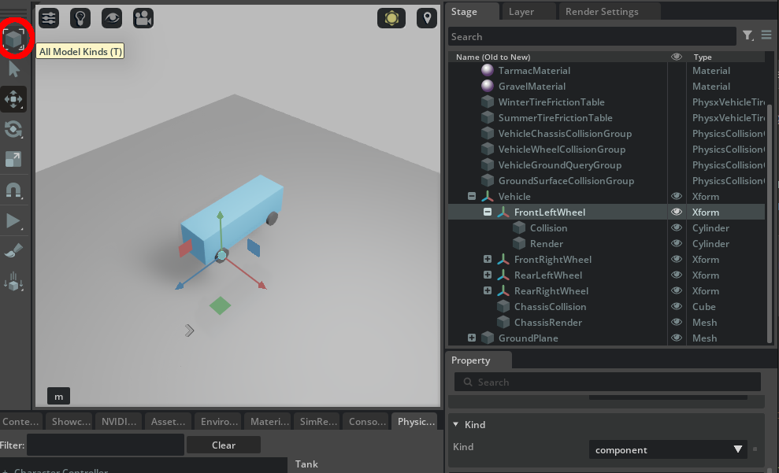

# Kind

The `kind` metadata can be authored via [UsdModelAPI](https://openusd.org/release/api/class_usd_model_a_p_i.html) and it is often used to tag a prim:

```python
def Xform "CameraMesh" (
    hide_in_stage_window = true # some metadata
    kind = "subcomponent" # kind metadata
    no_delete = true # some more metadata
)
{
    # usual rest of prim properties
    bool primvars:doNotCastShadows = 1
    bool primvars:omni:kit:isGizmo = 1
    ...
}
```

and is mainly used for two things:

1. During traversals you might want to detect where a complete 3D model hierarchy starts (i.e. the topmost parent of the self-contained 3D asset model), or where a custom-tagged sub-hierarchy of prims starts

    ```python
    from pxr import Sdf, UsdGeom, Usd, UsdLux, Gf, Kind
    import omni.usd
    import carb

    # Function to generate a random identifier and make the sibling prim names unique
    def generate_random_identifier(length=5):
        return ''.join(random.choice(string.ascii_letters) for _ in range(length))

    BASE_DIRECTORY = "/tmp"  # This is where the .usda files will be saved

    stage : Usd.Stage = Usd.Stage.CreateInMemory("RootLayer.usda")

    xform : UsdGeom.Xform = UsdGeom.Xform.Define(stage, Sdf.Path("/World"))
    environment_xform = UsdGeom.Xform.Define(stage, "/World/Environment")
    dome_light = UsdLux.DomeLight.Define(stage, "/World/Environment/DomeLight")
    dome_light.CreateIntensityAttr(1000)


    model_prim = stage.DefinePrim("/World/ThisIsAModel", "Xform")
    model_API = Usd.ModelAPI(model_prim)
    model_API.SetKind(Kind.Tokens.model)

    custom_prim = stage.DefinePrim("/World/ThisIsACustomKind", "Xform")
    model_API = Usd.ModelAPI(custom_prim)
    model_API.SetKind("custom")

    """
    prim /World/ThisIsAModel has kind: model
    prim /World/ThisIsACustomKind has kind: custom
    """
    for prim in stage.Traverse():
        kind = Usd.ModelAPI(prim).GetKind()
        if kind:
            print(f"prim {str(prim.GetPath())} has kind: {kind}")


    stage.GetRootLayer().Export(BASE_DIRECTORY + "/RootLayer.usda")
    omni.usd.get_context().open_stage(BASE_DIRECTORY + "/RootLayer.usda")
    ```

    There are also [`UsdPrim::IsModel`](https://openusd.org/dev/api/class_usd_prim.html#ad93a1d74f88e0a32113df97b3358e9d3) and [`UsdPrim::IsGroup`](https://openusd.org/dev/api/class_usd_prim.html#ad534b1a75ec6ebe6cb3d5883d683ec93) predicates that can be used during stage traversals (since they're very commonly used).

2. DCCs (digital content creation programs) that use USD might have a custom UI selection mode to facilitate the user in selecting something in their viewport. OV Composer uses this to switch between a `select_any_prim_under_the_cursor` and a `select_only_model_prims_under_the_cursor`

    

    This is better documented in the [selection modes documentation for OV Composer](https://docs.omniverse.nvidia.com/composer/latest/common/selection-modes.html); the same applies for any other DCC which uses USD and the kind selection mode switch.

If you're developing a USD Omniverse connector or working in USD within a DCC you can define your own tags and [register them via the plugin system](https://lucascheller.github.io/VFX-UsdSurvivalGuide/core/plugins/kind.html#creating-own-kinds). The default ones in OV Composer have usually the following meaning

| Kind | Description |
|------|-------------|
| model | This shouldn't be used directly as it's the base kind for all models |
| assembly | In a USD file representing a scene this is usually the kind of the topmost prim. This kind should be used for _published_ (i.e. shared with other artists) assets which aggregate other published components or assemblies together. Assemblies can sometimes override materials on individual components to better visually integrate them together. |
| group | A group of 3D models. These are usually the intermediate Xforms under an assembly. It shouldn't be used on the root of published assets since they're helper kinds. |
| component | The most basic asset published in a USD pipeline: it can be at the root prim of an asset and should _not_ reference external geometries or models. The main difference between an assembly and a component is that an assembly can be made of more components and reference outside stuff as well. A component is self-contained. |
| subcomponent | A subcomponent is usually a Xformable prim within a component model intentionally made available to apply some transformation. |

This is a ten-thousand feet overview but if you're interested into learning more there are [in-depth documents in the usd-wg repo](https://github.com/usd-wg/assets/blob/main/docs/asset-structure-guidelines.md) on the subject.