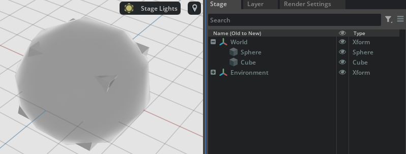

# Attributes

As we've already stated there are two kind of `properties`: `attributes` and `relationships`.

Let's get back to `/World/Cube:size` and similar attributes that we've quickly covered in the previous sections and add a few more words on how to access them via code.

Attributes can be provided via a `schema` or be user-defined (to be precise even `relationships` can be schema-provided or user-defined, therefore it is more correct to state that _properties can either be provided via a schema or be user-defined_).

```admonish tip
We will revisit `schemas` later, for now it suffices to think of them as _"inherited prim rules to define which properties are present on a prim which implements that schema, and what values are allowed for those properties"_
E.g. a `faceVertexIndices` attribute for a prim which implements the `UsdGeomMesh` schema **must** have type `VtArray<int>`, i.e. be an array of integer values. This type constraint (and the existence of that value which **must** be present) is enforced by the `UsdGeomMesh` schema definition.
```

In the `UsdGeomCube` schema, the attribute `size` is schema-provided and can be accessed in code as follows

```python
cube : UsdGeom.Cube = UsdGeom.Cube.Define(root_stage, "/World/Cube")
attr = cube.GetSizeAttr()
attr_value = attr.Get()
attr.Set(200)  # change attribute value
```

in python USD there are always getters for attributes defined in schemas of the form `.Get[ATTRIBUTENAME]Attr()` and they return a `UsdAttribute` whose value can be extracted via `Get()` and set via `Set()` as shown in the code above. For time-varying attributes you can also query which timecode you're interested in: `.Get(Usd.TimeCode.EarliestTime())`. Whether an attribute is time-varying can be queried via [`GetVariability()`](https://openusd.org/dev/api/class_usd_attribute.html#a79655ab3c82828093c685a1582d5e4bc).

Let's see an example of a cube prim where a custom attribute is checked for existence in various ways and created/set.

```python
from pxr import Sdf, UsdGeom, Usd, UsdLux, Gf
import omni.usd
import carb

BASE_DIRECTORY = "/tmp"  # This is where the .usda files will be saved

root_stage : Usd.Stage = Usd.Stage.CreateInMemory("RootLayer.usda")

# Add a cube to the scene

xform : UsdGeom.Xform = UsdGeom.Xform.Define(root_stage, Sdf.Path("/World"))
cube : UsdGeom.Cube = UsdGeom.Cube.Define(root_stage, "/World/Cube")
extent = [(-50, -50, -50), (50, 50, 50)]
cube.GetExtentAttr().Set(extent)
cube.GetSizeAttr().Set(100)
environment_xform = UsdGeom.Xform.Define(root_stage, "/World/Environment")
dome_light = UsdLux.DomeLight.Define(root_stage, "/World/Environment/DomeLight")
dome_light.CreateIntensityAttr(1000)

cube_prim : Usd.Prim = cube.GetPrim()

# Check if a custom myAttribute attribute already exists
my_custom_attr : Usd.Attribute = cube_prim.GetAttribute("myCustomFloatAttribute")
if my_custom_attr.IsValid():
    carb.log_warn("Attribute exists!")
    # my_custom_attr.Set(42.8)
else:
    carb.log_warn("Attribute does not exist yet")

attr = cube_prim.CreateAttribute("myCustomFloatAttribute", Sdf.ValueTypeNames.Float)
attr.Set(42.8)

my_custom_attr : Usd.Attribute = cube_prim.GetAttribute("myCustomFloatAttribute")
if my_custom_attr:  # use the boolean override to check for existence as well
    carb.log_warn("Attribute exists!")
else:
    carb.log_warn("Attribute does not exist yet")

# Access a non-custom attribute defined in the UsdGeomCube schema
cube = UsdGeom.Cube(cube_prim)
size_value = cube.GetSizeAttr().Get()
carb.log_warn(f"cube has size attr of value: {size_value}")

# Export root stage to file
root_stage.GetRootLayer().Export(BASE_DIRECTORY + "/RootLayer.usda")

# Issue an 'open-stage' command to avoid doing this manually and free whatever stage
# was previously owned by this context
omni.usd.get_context().open_stage(BASE_DIRECTORY + "/RootLayer.usda")
```

As already noted custom attributes are not part of a schema and marked as `custom` in USDA:

```python
$ cat /tmp/RootLayer.usda
#usda 1.0

def Xform "World"
{
    def Cube "Cube"
    {
        float3[] extent = [(-50, -50, -50), (50, 50, 50)]
        custom float myCustomFloatAttribute = 42.8  # <---------
        double size = 100
    }

    def Xform "Environment"
    {
        def DomeLight "DomeLight"
        {
            float inputs:intensity = 1000
        }
    }
}
```

Whether an attribute is `custom` can be queried via [`IsCustom()`](https://openusd.org/dev/api/class_usd_property.html#ad0ffcc4c9b780ba8f6dd5a92746c0059).

## Primspecs

A `Primspec` is the part of a prim which resides in a layer only: if a layer only has an `over`ride for a prim's attribute, the `Primspec` will just be a view over that `over` specifier with an `AttributeSpec` inside that redefines that attribute. Think of a `Primspec` as a `git delta` for a specific prim, on a specific layer.

Enumerating all the attributes of a prim by querying the `UsdPrim` on the _composed_ (i.e. where all of the hard work of resolving opinions, etc. has already been done) stage is performed via

```python
cube_prim = cube.GetPrim()
for attr in cube_prim.GetAttributes():
    print(attr)
```

and yields all of the attributes applied by schemas and the `primvars` attributes (used by the Hydra renderer usually):

```python
Usd.Prim(</World/Cube>).GetAttribute('doubleSided')
Usd.Prim(</World/Cube>).GetAttribute('extent')
Usd.Prim(</World/Cube>).GetAttribute('orientation')
Usd.Prim(</World/Cube>).GetAttribute('primvars:displayColor')
Usd.Prim(</World/Cube>).GetAttribute('primvars:displayOpacity')
Usd.Prim(</World/Cube>).GetAttribute('purpose')
Usd.Prim(</World/Cube>).GetAttribute('size')
Usd.Prim(</World/Cube>).GetAttribute('testValue')
Usd.Prim(</World/Cube>).GetAttribute('visibility')
Usd.Prim(</World/Cube>).GetAttribute('xformOpOrder')
```

But if we enumerate the attributes in a `Sdf.PrimSpec`, we will find only the attributes that are effectively _defined_ or _authored_ in that specific layer: in the case of just an `over`ride for a `radius` attribute for a sphere in a `another_layer`, here's what we would get:

```python
$ cat /tmp/another_layer.usda
#usda 1.0
()

over "World"
{
    over "Sphere"
    {
        double radius = 200
    }
}
```

```
another_layer = Sdf.Layer.FindOrOpen("/tmp/another_layer.usda")
primSpec : Sdf.PrimSpec = another_layer.GetPrimAtPath("/World/Sphere")
for attr in primSpec.attributes:
    print(attr.GetAsText())  # prints "double radius = 200"
```

`PrimSpec`s allow us to **enumerate** the contributions of a layer **without composing the stage first** (which can be quite expensive due to the `LIVRS` and opinion resolution); they also allow us to **create** definitions, overrides, etc. in _a single layer_.

Here's a rather involved example which defines a `RootLayer` which references `AnotherLayer` as a sublayer. `RootLayer` overrides the `Sphere` defined in the other layer and overrides the `radius` attribute. The sphere has a `CollisionAPI` applied, just to showcase how `PrimSpec`s can enumerate those as well. Finally also a new `Cube` prim is **defined** in the `RootLayer` through a newly created `PrimSpec`.

```python
from pxr import Sdf, UsdGeom, Usd, UsdLux, Gf, UsdPhysics
import omni.usd
import carb

BASE_DIRECTORY = "/tmp"  # This is where the .usda files will be saved

root_stage : Usd.Stage = Usd.Stage.CreateInMemory("RootLayer.usda")
another_stage : Usd.Stage = Usd.Stage.CreateInMemory("AnotherLayer.usda")

# Create a Xform "World" and a Sphere "Sphere" prim in the "another stage"

xform : UsdGeom.Xform = UsdGeom.Xform.Define(another_stage, Sdf.Path("/World"))
sphere : UsdGeom.Sphere = UsdGeom.Sphere.Define(another_stage, "/World/Sphere")
extent = [(-30, -30, -30), (30, 30, 30)]
sphere.GetExtentAttr().Set(extent)
radius = sphere.GetRadiusAttr()
radius.Set(50)
environment_xform = UsdGeom.Xform.Define(another_stage, "/Environment")
dome_light = UsdLux.DomeLight.Define(another_stage, "/Environment/DomeLight")
dome_light.CreateIntensityAttr(1000)

# Apply a physics CollisionAPI (defined in a schema) to the Sphere in the "another stage"
UsdPhysics.CollisionAPI.Apply(sphere.GetPrim())

# Set "another stage" as a sublayer in the "root layer"
another_stage.GetRootLayer().Export(BASE_DIRECTORY + "/AnotherLayer.usda")
root_stage.GetRootLayer().subLayerPaths.append(BASE_DIRECTORY + "/AnotherLayer.usda")

# Also add an override in the "root layer" for the radius defined in "another layer"
sphere_override_prim = root_stage.OverridePrim("/World/Sphere")
sphere_override : UsdGeom.Sphere = UsdGeom.Sphere(sphere_override_prim)
radius = sphere_override.CreateRadiusAttr()
radius.Set(200)

# Now for the interesting part: enumerate the primspecs in the root layer

ref_layer = root_stage.GetRootLayer()
primSpec : Sdf.PrimSpec = ref_layer.GetPrimAtPath("/World/Sphere")
print(ref_layer.GetObjectAtPath("/World/Sphere"))
for attr in primSpec.attributes:
    # attr is Sdf.AttributeSpec
    # Usd.Attribute and customAttributes have a GetTypeName() function,
    # while Sdf.AttributeSpec has a typeName field
    # print(attr.typeName)
    print(attr.GetAsText())  # pretty-print whatever this attributespec contains


# Create another primspec in this very same root layer - this defines a cube
cube = Sdf.PrimSpec(ref_layer.GetPrimAtPath("/World"), "Cube", # this is the name
    Sdf.SpecifierDef,
    "Cube") # this is the type
size = Sdf.AttributeSpec(cube, "size", Sdf.ValueTypeNames.Double)
size.default = 250.0

# Enumerate the primspecs for sphere in the "another layer" and get the 'apiSchemas'
ref_layer = another_stage.GetRootLayer()
prim_spec: Sdf.PrimSpec = ref_layer.GetObjectAtPath("/World/Sphere")
api_schemas_metadata : Sdf.ListOpType = prim_spec.GetInfo("apiSchemas")
for api in api_schemas_metadata.prependedItems:
    print(api)  # this should print the 'CollisionAPI' schema

# Export root layer to file and open it
root_stage.GetRootLayer().Export(BASE_DIRECTORY + "/RootLayer.usda")
omni.usd.get_context().open_stage(BASE_DIRECTORY + "/RootLayer.usda")
```

USDA is provided for completeness

```python
$ cat /tmp/RootLayer.usda
#usda 1.0
(
    subLayers = [
        @/tmp/AnotherLayer.usda@
    ]
)

over "World"
{
    over "Sphere"
    {
        double radius = 200
    }

    def Cube "Cube"
    {
        double size = 250
    }
}

$ cat /tmp/AnotherLayer.usda
#usda 1.0

def Xform "World"
{
    def Sphere "Sphere" (
        prepend apiSchemas = ["PhysicsCollisionAPI"]
    )
    {
        float3[] extent = [(-30, -30, -30), (30, 30, 30)]
        double radius = 50
    }
}

def Xform "Environment"
{
    def DomeLight "DomeLight"
    {
        float inputs:intensity = 1000
    }
}

```



Primspecs are an advanced USD concept but they allow for quite powerful manipulations of the scene graphs.
