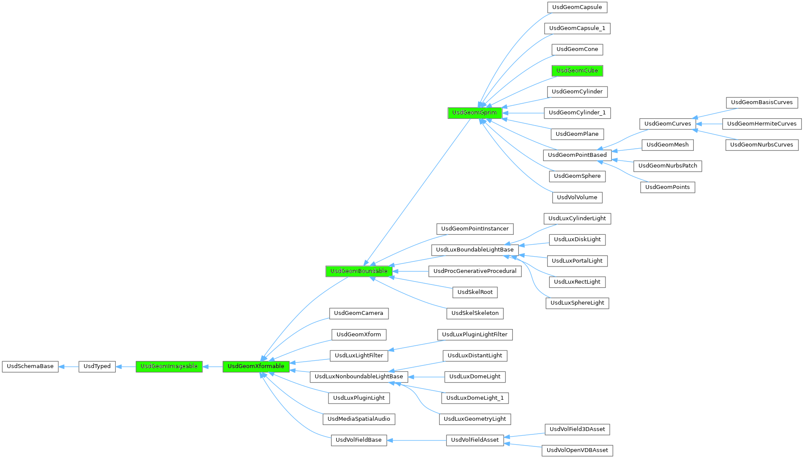

# Transformations

Transformations in USD are represented with the [UsdGeomXformOp](https://openusd.org/dev/api/class_usd_geom_xform_op.html) class, e.g. `xformOp:translate`, `xformOp:scale`, `xformOp:orient` (to represent a rotation with a quaternion) or `xformOp:rotateYXZ` (to represent a rotation with euler angles applied in this order: `Y`, `X` and then finally `Z`). Note the property namespace `xformOp` where all operations are defined.

The transformations are stored along a prim and can be overridden in stronger layers and/or composed in the usual USD fashion. The class responsible for managing transformation on a prim is called [`UsdGeomXformable`](https://openusd.org/dev/api/class_usd_geom_xformable.html).

As we've already seen USD uses inheritance to model which functionalities a prim owns: in the following graph the green boxes represent classes from the [`UsdGeomImageable`](https://openusd.org/dev/api/class_usd_geom_imageable.html) base class that provides attributes and functions for all prims that require rendering or visualization, to [`UsdGeomXformable`](https://openusd.org/dev/api/class_usd_geom_xformable.html) which provides a stack of operations (translate/rotate/etc.) that will be applied to the prim before visualizing it, to [`UsdGeomGprim`](https://openusd.org/dev/api/class_usd_geom_gprim.html) which is the base class for all geometric primitives (and encodes stuff like `doubleSided` or `orientation` and where the `displayColor` primvar also resides) to the [`UsdGeomCube`](https://openusd.org/dev/api/class_usd_geom_cube.html) class which we've already seen many times to create a `Cube` prim.



Let's take a look at a simple example of an `Xform` with a child `Cube` prim: the `Xform` will have a scale and a translation transformations in its local stack and therefore those transformations will be inherited by the `Cube` as well.

```py
from pxr import Sdf, UsdGeom, Usd, UsdLux, Gf, Kind
import omni.usd
import carb

BASE_DIRECTORY = "/tmp"  # This is where the .usda files will be saved

stage : Usd.Stage = Usd.Stage.CreateInMemory("RootLayer.usda")

xform : UsdGeom.Xform = UsdGeom.Xform.Define(stage, Sdf.Path("/World"))
environment_xform = UsdGeom.Xform.Define(stage, "/World/Environment")
dome_light = UsdLux.DomeLight.Define(stage, "/World/Environment/DomeLight")
dome_light.CreateIntensityAttr(1000)

# Create an Xform and a Cube as child of the Xform
xform : UsdGeom.Xform = UsdGeom.Xform.Define(stage, "/World/Xform")
cube : UsdGeom.Cube = UsdGeom.Cube.Define(stage, "/World/Xform/Cube")

if not xform.GetPrim().IsA(UsdGeom.Xformable):
    carb.log_error("Unexpected! A Xform derives from Xformable, as gprims do!")

# Define a scaling operation and a translation on the Xform
# These will be inherited by the cube's transformation

scale = Gf.Vec3f(50, 50, 50)
# Try to get the scale attribute or create it in case it doesn't exist yet
dstOp = UsdGeom.XformOp(xform.GetPrim().GetAttribute("xformOp:scale"))
if not dstOp:
    # Create this scale op
    xformable : UsdGeom.Xformable = UsdGeom.Xformable(xform)
    dstOp = xformable.AddXformOp(UsdGeom.XformOp.TypeScale, UsdGeom.XformOp.PrecisionFloat)
dstOp.Set(Gf.Vec3f(scale))

translate = Gf.Vec3f(20, 0, 0)
dstOp = UsdGeom.XformOp(xform.GetPrim().GetAttribute("xformOp:translate"))
if not dstOp:
    # Create this translate op
    xformable : UsdGeom.Xformable = UsdGeom.Xformable(xform)
    dstOp = xformable.AddXformOp(UsdGeom.XformOp.TypeTranslate, UsdGeom.XformOp.PrecisionFloat)
dstOp.Set(Gf.Vec3f(translate))

stage.GetRootLayer().Export(BASE_DIRECTORY + "/RootLayer.usda")
omni.usd.get_context().open_stage(BASE_DIRECTORY + "/RootLayer.usda")
```

If you inspect the generated `.usda`, you'll find that the order of the `XformOp`s as we added them was also stored:

```py
$ cat /tmp/RootLayer.usda
#usda 1.0

def Xform "World"
{
    def Xform "Environment"
    {
        def DomeLight "DomeLight"
        {
            float inputs:intensity = 1000
        }
    }

    def Xform "Xform"
    {
        float3 xformOp:scale = (50, 50, 50)
        float3 xformOp:translate = (20, 0, 0)
        uniform token[] xformOpOrder = ["xformOp:scale", "xformOp:translate"]   # Order is stored

        def Cube "Cube"
        {
        }
    }
}
```

In case we wanted to apply first the translate operation and then the scale operation, the order could also have been changed by re-assigning those operations to the `Xform` local stack with [`SetXformOpOrder`](https://openusd.org/dev/api/class_usd_geom_xformable.html#a4b6dd6e51eb84725c763d064c4f9f3ba).

## Reset Xform Stack

There is one particular operation called `!resetXformOp!` which acts like a boolean flag: if added to a prim

* it is always added as first op in the `xformOpOrder`
* it causes the prim **not** to inherit its parent's transformation

Let's see the same example as before but with a `!resetXformOp!` applied to the `Cube` (**not** to the `Xform` - it would mean that we don't want the `Xform` to inherit transformations by `/World`, but that's not what we're trying to do here):

```py
from pxr import Sdf, UsdGeom, Usd, UsdLux, Gf, Kind
import omni.usd
import carb

BASE_DIRECTORY = "/tmp"  # This is where the .usda files will be saved

stage : Usd.Stage = Usd.Stage.CreateInMemory("RootLayer.usda")

xform : UsdGeom.Xform = UsdGeom.Xform.Define(stage, Sdf.Path("/World"))
environment_xform = UsdGeom.Xform.Define(stage, "/World/Environment")
dome_light = UsdLux.DomeLight.Define(stage, "/World/Environment/DomeLight")
dome_light.CreateIntensityAttr(1000)

# Create an Xform and a Cube as child of the Xform
xform : UsdGeom.Xform = UsdGeom.Xform.Define(stage, "/World/Xform")
cube : UsdGeom.Cube = UsdGeom.Cube.Define(stage, "/World/Xform/Cube")

if not xform.GetPrim().IsA(UsdGeom.Xformable):
    carb.log_error("Unexpected! A Xform derives from Xformable, as gprims do!")

# Define a scaling operation and a translation on the Xform. But also set a
# resetXformStack op: the transformations will *NOT* be inherited by the cube

scale = Gf.Vec3f(50, 50, 50)
# Try to get the scale attribute or create it in case it doesn't exist yet
dstOp = UsdGeom.XformOp(xform.GetPrim().GetAttribute("xformOp:scale"))
if not dstOp:
    # Create this scale op
    xformable : UsdGeom.Xformable = UsdGeom.Xformable(xform)
    dstOp = xformable.AddXformOp(UsdGeom.XformOp.TypeScale, UsdGeom.XformOp.PrecisionFloat)
dstOp.Set(Gf.Vec3f(scale))

translate = Gf.Vec3f(20, 0, 0)
dstOp = UsdGeom.XformOp(xform.GetPrim().GetAttribute("xformOp:translate"))
if not dstOp:
    # Create this translate op
    xformable : UsdGeom.Xformable = UsdGeom.Xformable(xform)
    dstOp = xformable.AddXformOp(UsdGeom.XformOp.TypeTranslate, UsdGeom.XformOp.PrecisionFloat)
dstOp.Set(Gf.Vec3f(translate))

# Set the resetXformStack on the cube (NOT to the Xform.. otherwise the cube would have been affected)
xformable : UsdGeom.Xformable = UsdGeom.Xformable(cube.GetPrim())
xformable.SetResetXformStack(True)

stage.GetRootLayer().Export(BASE_DIRECTORY + "/RootLayer.usda")
omni.usd.get_context().open_stage(BASE_DIRECTORY + "/RootLayer.usda")
```

```py
$ cat /tmp/RootLayer.usda
#usda 1.0

def Xform "World"
{
    def Xform "Environment"
    {
        def DomeLight "DomeLight"
        {
            float inputs:intensity = 1000
        }
    }

    def Xform "Xform"
    {
        float3 xformOp:scale = (50, 50, 50)
        float3 xformOp:translate = (20, 0, 0)
        uniform token[] xformOpOrder = ["xformOp:scale", "xformOp:translate"]

        def Cube "Cube"
        {
            uniform token[] xformOpOrder = ["!resetXformStack!"]  # Note the resetXformStack
        }
    }
}
```

Note how the `!resetXformStack!` was declared as a `uniform` token: tokens are types of attributes in USD which can encode string values, paths or - as in this case - concepts that do _not_ vary over time or across different instances of a prim (think of `uniform` pretty much like a GLSL shader's `uniform`).

In this second example the cube will _not_ inherit any scaling nor translation from its parent's hierarchy and therefore remain with its default dimensions at origin `(0;0;0)`.