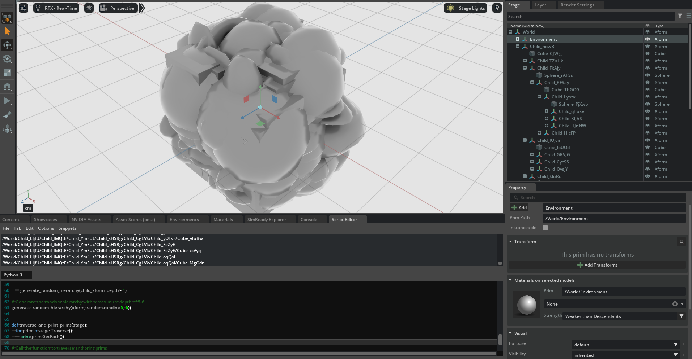

# Traversing

Traversing means 'scanning' all (or a subset of) the prims on a stage.

The simplest form of traversal is:

```python
def traverse_and_print_prim_paths(stage):
    for prim in stage.Traverse():
        print(prim.GetPath())

traverse_and_print_prim_paths(stage)
```

You can test this out by generating a random scene hierarchy of prims (this is mostly boilerplate code)



```python
from pxr import Sdf, UsdGeom, Usd, UsdLux, Gf
import omni.usd
import carb
import random
import string

# Function to generate a random identifier and make the sibling prim names unique
def generate_random_identifier(length=5):
    return ''.join(random.choice(string.ascii_letters) for _ in range(length))

BASE_DIRECTORY = "/tmp"  # This is where the .usda files will be saved

stage : Usd.Stage = Usd.Stage.CreateInMemory("RootLayer.usda")

xform : UsdGeom.Xform = UsdGeom.Xform.Define(stage, Sdf.Path("/World"))
environment_xform = UsdGeom.Xform.Define(stage, "/World/Environment")
dome_light = UsdLux.DomeLight.Define(stage, "/World/Environment/DomeLight")
dome_light.CreateIntensityAttr(1000)


# Function to generate a random scene hierarchy
def generate_random_hierarchy(parent_xform, depth):
    if depth <= 0:
        return

    for _ in range(random.randint(1, 4)):  # Randomly choose 1 to 4 children
        child_name = "Child_" + generate_random_identifier()  # Add a random identifier
        child_xform = UsdGeom.Xform.Define(stage, parent_xform.GetPath().AppendChild(child_name))
        if random.choice([True, False]):  # Randomly choose to add cube or sphere
            shape_name = "Cube_" + generate_random_identifier()  # Add a random identifier
            cube = UsdGeom.Cube.Define(stage, child_xform.GetPath().AppendChild(shape_name))
            extent = [(random.uniform(-50, 50), random.uniform(-50, 50), random.uniform(-50, 50)),
                      (random.uniform(-50, 50), random.uniform(-50, 50), random.uniform(-50, 50))]
            cube.GetExtentAttr().Set(extent)
            cube.GetSizeAttr().Set(random.uniform(10, 100))

            # Add random small offsets from the center
            offset = Gf.Vec3d(random.uniform(-100, 100), random.uniform(-100, 100), random.uniform(-100, 100))
            cube_center = Gf.Vec3d(0, 0, 0)  # Center of the scene
            cube_center += offset
            UsdGeom.Xformable(cube.GetPrim()).AddTranslateOp().Set(cube_center)

        else:
            shape_name = "Sphere_" + generate_random_identifier()  # Add a random identifier
            sphere = UsdGeom.Sphere.Define(stage, child_xform.GetPath().AppendChild(shape_name))
            extent = [(random.uniform(-50, 50), random.uniform(-50, 50), random.uniform(-50, 50)),
                      (random.uniform(-50, 50), random.uniform(-50, 50), random.uniform(-50, 50))]
            sphere.GetExtentAttr().Set(extent)

            # Add random small offsets from the center
            offset = Gf.Vec3d(random.uniform(-100, 100), random.uniform(-100, 100), random.uniform(-100, 100))
            sphere_center = Gf.Vec3d(0, 0, 0)  # Center of the scene
            sphere_center += offset
            UsdGeom.Xformable(sphere.GetPrim()).AddTranslateOp().Set(sphere_center)

            UsdGeom.Xformable(sphere.GetPrim()).AddScaleOp().Set(Gf.Vec3d(random.uniform(10, 100),
                                                                          random.uniform(10, 100),
                                                                          random.uniform(10, 100)))

        generate_random_hierarchy(child_xform, depth - 1)

# Generate the random hierarchy with a maximum depth of 5-6
generate_random_hierarchy(xform, random.randint(5, 6))


# Traversal!
####################################
def traverse_and_print_prim_paths(stage):
    for prim in stage.Traverse():
        print(prim.GetPath())

traverse_and_print_prim_paths(stage)
####################################


stage.GetRootLayer().Export(BASE_DIRECTORY + "/RootLayer.usda")
omni.usd.get_context().open_stage(BASE_DIRECTORY + "/RootLayer.usda")
```

Other common ways of scanning prims is by searching for specific types of prims (e.g. of `Sphere` type)

```python
from typing import List, Type

def find_prims_by_type(stage: Usd.Stage, prim_type: Type[Usd.Typed]) -> List[Usd.Prim]:
    found_prims = [x for x in stage.Traverse() if x.IsA(prim_type)]
    return found_prims

prims: List[Usd.Prim] = find_prims_by_type(stage, UsdGeom.Sphere)
print(prims)
```

There are also [`UsdPrim::GetChild`](https://openusd.org/dev/api/class_usd_prim.html#a8c0974bbd49570564f0096ce982ff64a) functions and [UsdPrim::GetChildren()](https://openusd.org/dev/api/class_usd_prim.html#a2619563fc9180d8ead597944fd7f6ec7) and [UsdPrim::GetAllChildren()](https://openusd.org/dev/api/class_usd_prim.html#a0173b7fe85d33e147f820033f4b08f0e) (the former returns the _active, loaded, defined and non-abstract_ children of a prim, the latter returns _any_ child).

## Instance traversals

Recall that normal traversals don't work with [instances](./instancing.md), in case you need to traverse instance proxies, you should use `Usd.TraverseInstanceProxies`

```python
from pxr import Sdf, UsdGeom, Usd, UsdLux, Gf
import omni.usd
import carb

BASE_DIRECTORY = "/tmp"  # This is where the .usda files will be saved

parking_lot_stage : Usd.Stage = Usd.Stage.CreateInMemory("ParkingLot.usda")
car_stage : Usd.Stage = Usd.Stage.CreateInMemory("Car.usda")

# Car stage
xform : Usd.Prim = car_stage.DefinePrim(Sdf.Path("/Car"))
xform.GetPrim().CreateAttribute("color", Sdf.ValueTypeNames.Color3f).Set(Gf.Vec3f(0, 0, 0))
body : UsdGeom.Mesh = UsdGeom.Mesh.Define(car_stage, Sdf.Path("/Car/Body"))
body.GetPrim().CreateAttribute("color", Sdf.ValueTypeNames.Color3f).Set(Gf.Vec3f(0, 0, 0))
Door : UsdGeom.Mesh = UsdGeom.Mesh.Define(car_stage, Sdf.Path("/Car/Door"))
car_stage.GetRootLayer().Export(BASE_DIRECTORY + "/Car.usda")

# Parking Lot stage
xform : Usd.Prim = parking_lot_stage.DefinePrim(Sdf.Path("/ParkingLot"))
car1_prim : Usd.Prim = parking_lot_stage.DefinePrim("/ParkingLot/Car_1")
loaded_layer = Sdf.Layer.FindOrOpen(BASE_DIRECTORY + "/Car.usda")
car1_prim.GetReferences().AddReference(loaded_layer.identifier, "/Car")
car2_prim : Usd.Prim = parking_lot_stage.DefinePrim("/ParkingLot/Car_2")
loaded_layer = Sdf.Layer.FindOrOpen(BASE_DIRECTORY + "/Car.usda")
car2_prim.GetReferences().AddReference(loaded_layer.identifier, "/Car")
car3_prim : Usd.Prim = parking_lot_stage.DefinePrim("/ParkingLot/Car_3")
loaded_layer = Sdf.Layer.FindOrOpen(BASE_DIRECTORY + "/Car.usda")
car3_prim.GetReferences().AddReference(loaded_layer.identifier, "/Car")

# Mark with metadata Car_1 and Car_2 as instanceable, i.e. "these reference prims can be reused"
# while Car_3 is not marked
car1_prim.SetInstanceable(True)
car2_prim.SetInstanceable(True)


# Traversal!
####################################

# This will only return non-instance prims
# def traverse_and_print_prim_paths(stage):
#     for prim in stage.Traverse():
#         print(prim.GetPath())
# traverse_and_print_prim_paths(parking_lot_stage)

# This will only return non-instance prims
def traverse_and_print_all_prim_paths(stage):
    for prim in stage.Traverse(Usd.TraverseInstanceProxies()):
        print(prim.GetPath())
traverse_and_print_all_prim_paths(parking_lot_stage)

####################################

# Export root layer to file
parking_lot_stage.GetRootLayer().Export(BASE_DIRECTORY + "/ParkingLot.usda")
omni.usd.get_context().open_stage(BASE_DIRECTORY + "/ParkingLot.usda")
```