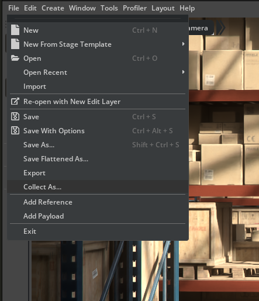
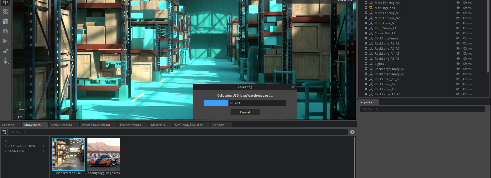
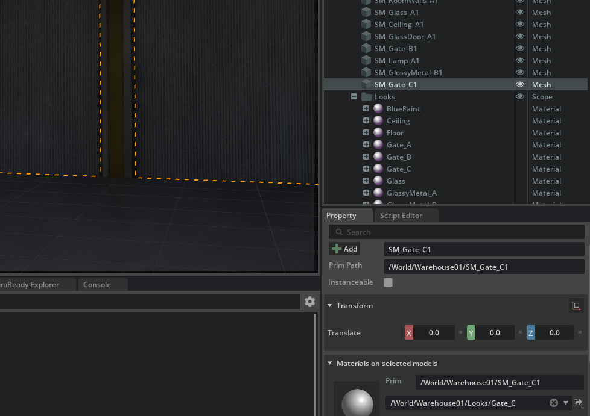

# Stage Population Masks

There's an interesting technique to only load and compose parts of a stage instead of loading the entire stage and composing everything (and remember that for the same stage, rendering it is _infinitely_ more expensive than just composing it and resolving opinions and references..): **population masks**.

For example let's suppose we have a very large USD scene: we'll use the `IsaacWarehouse` USD Composer showcase for this code sample. One can download all of the non-flattened USD assets to disk by loading it in Composer and then selecting `File->Collect As..` and specifying a local temporary directory where to save a large quantity of data for that scene




Let's suppose we want to find out the material associated with the main gate prim `/World/Warehouse01/SM_Gate_C1`, this involves a lookup for the direct material-binding _relationship_. From the Property Window UI of the loaded scene we can see that we're looking for `/World/Warehouse01/Looks/Gate_C`



Let's do this in code in two different ways:

1. In this first way we'll load the huge `IsaacWarehouse.usd` scene with `Usd.Stage.Open()` and compose it entirely before querying the gate for its directly associated material

    ```py
    from pxr import Sdf, UsdGeom, Usd, UsdLux, Gf, UsdShade
    import omni.usd
    import carb
    import time

    # Record the start time
    start_time = time.time()

    ################################
    ### composition happens here ###
    ### POTENTIALLY VERY SLOW    ###
    ################################
    stage : Usd.Stage = Usd.Stage.Open("/tmp/big_usd_scene/Collected_IsaacWarehouse/IsaacWarehouse.usd")

    # Record the end time and print the elapsed time in seconds
    end_time = time.time()
    elapsed_time = end_time - start_time
    print(f"Elapsed time: {elapsed_time} seconds")

    # Continue with gathering the material bound to the gate prim

    gate_prim : Usd.Prim = stage.GetPrimAtPath("/World/Warehouse01/SM_Gate_C1")
    material_binding = UsdShade.MaterialBindingAPI(gate_prim)
    # Do not specify a specific 'purpose' in GetDirectBindingRel()
    # (a material can be bound in 'preview' and another one, heavier, for 'full' scene rendering),
    # just get any of them
    relationship : Usd.Relationship = material_binding.GetDirectBindingRel()
    direct_binding : UsdShade.MaterialBindingAPI.DirectBinding = UsdShade.MaterialBindingAPI.DirectBinding(relationship)

    if not direct_binding.GetMaterial():
        carb.log_error("No material directly associated")

    material_path : Sdf.Path = direct_binding.GetMaterialPath()
    prim : Usd.Prim = stage.GetPrimAtPath(material_path)

    material_bound_to_gate : UsdShade.Material = UsdShade.Material(prim)

    print(material_bound_to_gate.GetPath())  # /World/Warehouse01/Looks/Gate_C
    ```

    Output:
    ```py
    Elapsed time: 0.02084561 seconds
    /World/Warehouse01/Looks/Gate_C
    ```

2. Now let's see an alternative way of getting the same data, but this time let's use `Usd.Stage.OpenMasked()` which accepts a list of prim paths to load (all of their children will be loaded as well) so we can 'prune' the stage hierarchy and avoid loading and composing unnecessary stuff

    ```py
    from pxr import Sdf, UsdGeom, Usd, UsdLux, Gf, UsdShade
    import omni.usd
    import carb
    import time

    # Record the start time
    start_time = time.time()

    #################################################
    ### composition happens here                  ###
    ### but only for the requested prim paths!    ###
    #################################################
    primpaths_to_load = ["/World/Warehouse01/SM_Gate_C1", "/World/Warehouse01/Looks"]
    population_mask = Usd.StagePopulationMask(primpaths_to_load)
    stage : Usd.Stage = Usd.Stage.OpenMasked("/tmp/big_usd_scene/Collected_IsaacWarehouse/IsaacWarehouse.usd", population_mask)

    # Record the end time and print the elapsed time in seconds
    end_time = time.time()
    elapsed_time = end_time - start_time
    print(f"Elapsed time: {elapsed_time} seconds")

    # Continue with gathering the material bound to the gate prim

    gate_prim : Usd.Prim = stage.GetPrimAtPath("/World/Warehouse01/SM_Gate_C1")
    material_binding = UsdShade.MaterialBindingAPI(gate_prim)
    # Do not specify a specific 'purpose' in GetDirectBindingRel()
    # (a material can be bound in 'preview' and another one, heavier, for 'full' scene rendering),
    # just get any of them
    relationship : Usd.Relationship = material_binding.GetDirectBindingRel()
    direct_binding : UsdShade.MaterialBindingAPI.DirectBinding = UsdShade.MaterialBindingAPI.DirectBinding(relationship)

    if not direct_binding.GetMaterial():
        carb.log_error("No material directly associated")

    material_path : Sdf.Path = direct_binding.GetMaterialPath()
    prim : Usd.Prim = stage.GetPrimAtPath(material_path)

    material_bound_to_gate : UsdShade.Material = UsdShade.Material(prim)

    print(material_bound_to_gate.GetPath())  # /World/Warehouse01/Looks/Gate_C
    ```

    Output:
    ```py
    Elapsed time: 0.00132393 seconds
    /World/Warehouse01/Looks/Gate_C
    ```

Even though opening the stage and composing it only took ~20 milliseconds with `Usd.Stage.Open()`, `Usd.Stage.OpenMasked()` took ~1 millisecond: this technique can be quite effective to avoid loading and composing unnecessary parts of the stage.

A lower level technique would have been opening the layers manually (either by opening the .usd files or following `reference`s via code) and [inspecting primspecs](../chapter4/primspecs_and_attributes.md) in those layers and looking for material binding relationships and resolving them to the final material path. Properly optimized code could have been even faster with low-level primspec parsing, but population masks are substantially easier to use and quite effective too.
