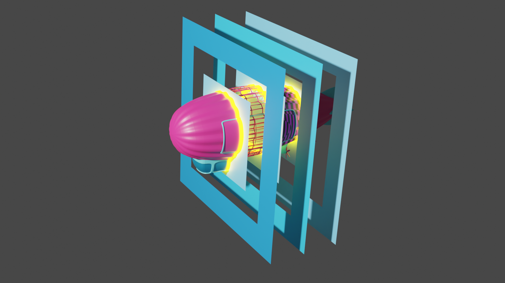

# Credits

Created by [Marco Alesiani](https://www.linkedin.com/in/marcodiiga/).

This book and its webGL frontpage use open source libraries and technologies. Some paragraphs also draw from freely shared material.

* [glTF 2.0 viewer](https://github.com/donmccurdy/three-gltf-viewer)
* [developer-office-hours sample extensions](https://github.com/mati-nvidia/developer-office-hours)
* [stemkoski Three.js selective glow](http://stemkoski.github.io/Three.js/Selective-Glow.html)
* [Book of USD](https://remedy-entertainment.github.io/USDBook/)
* [VFX USD Survival Guide](https://lucascheller.github.io/VFX-UsdSurvivalGuide/)

A huge thank you to all people who made this possible.